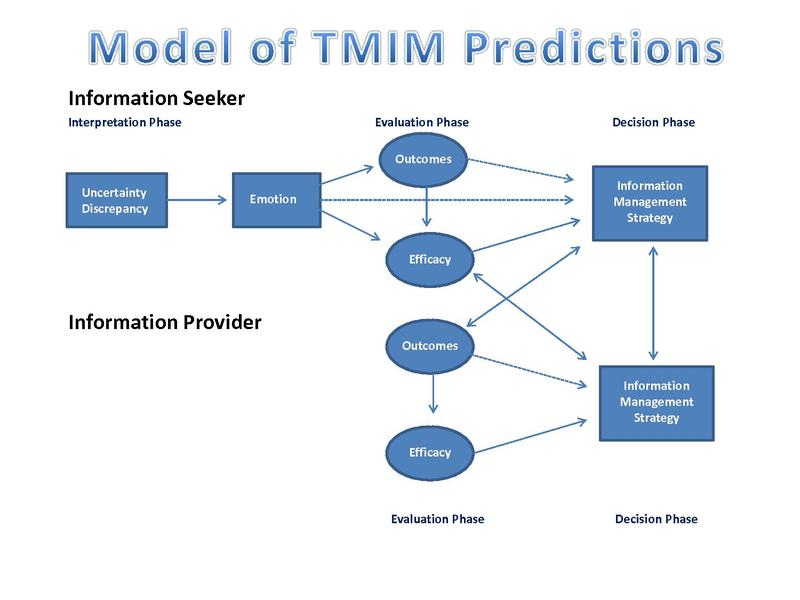
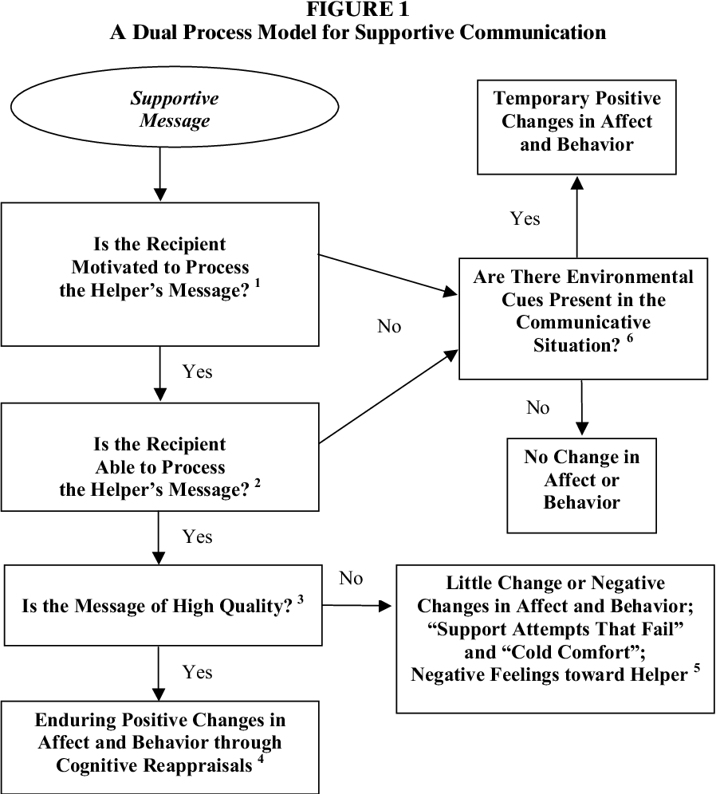

# Individually Centered

## Uncertainty Management Theories

### Problematic Integration Theory

Problematic Integration (PI) theory: From the theories of planned behavior and reasoned action, we believe that we can
predict people's behaviors because people are assumed to be "rational". However, there are communication substance that
could input uncertainty and inconsistency expectations to predict human behavior.

-   Goals:

    -   find important and ubiquitous communication process
    -   increase sophistication
    -   encourage other ways of understanding
    -   increase communicators' empathy and compassion.

-   Forms of PI:

    -   Uncertainty
    -   Diverging expectations and desires
    -   Ambivalence
    -   Impossible desires (theoretical vs. practical impossibility).

-   Discussion regarding PI can deepen or hurt relationships

-   Encounter PI, we can engage in presentational and avoidance rituals.

-   PI defines uncertainty as "difficulty forming a mental association". [@Babrow_2009]

    -   form-specific adaptation of messages means "communicating in ways that speak to the precise dilemma."
        [@Babrow_2009]

### Uncertainty Management Theory

Uncertainty Management (UM)

-   Based on two post-positivist sources:

    -   Uncertainty reduction theory [@BERGER_1975]: managing uncertainty
    -   Cognitive theory of uncertainty in illness [@Mishel_1990]: depending on context, uncertainty can be either good
        or bad

-   Uncertainty must be appraised.

-   Notion of management = control

Research and practical application (e.g., health, education, )\
Evaluation: not achievable under post-positivist because of its blurry boundary conditions. But under interpretivist, it
can make more sense due to its contextual meanings.

Application:\
Taking Control: The Efficacy and Durability of a Peer-Led Uncertainty Management Intervention for People Recently
Diagnosed With HIV [@Brashers_2016]: Uncertainty management need to be adaptable. Due to the changing nature of HIV
skills and information for patients need to be communicated continuously. Supported by the theories of social support,
uncertainty management can be facilitated with peer support. participant report less illness-related uncertainty,
greater access to social support, and more satisfaction with the social support compared to the control group. **Illness
uncertainty** was assessed with [@MISHEL_1981].

Example

[@SHARABI_2017] Effects of the first FtF date on romantic relationship development:

-   Relational choice models of romantic relationships: Choosing partners that make the most sense to you (fit an image
    of an ideal mates).
-   Disillusionment models of romantic relationship: When you see other's aspects (e.g., personality, behaviors) of your
    partner, you might no longer be interested in your partner.

Predicting first date success in online dating

-   Similarity and uncertainty as predictors: users want to reduce uncertainty before meeting offline.\
-   Communication as moderating role.

Interestingly, people disclose more deeply online compared to offline [@Tidwell_2002]

### Theory of Motivated Informaiton Management (TMIM)

Born from the frustration with [Problematic Integration Theory], [Uncertainty Management Theory] interepretivist
orientation, and desire to incorporate individual experience's complexity with uncertainty and predictive specificity.

The theory has its basis on:

-   Subjective Expected Utility theory [@Fischhoff_1983]\
-   social Cognitive theory [@Locke_1987]
-   Theories of bounded rationality [@Kahneman_2003]: People make suboptimal choice due to other emotions and bias
    factors.

Due to its laborious process of decision, theory of motivated information management only applies to cases where the
person thinks a decision is sufficient important.

Phases:

-   Interpretation Phase: recognize the difference (called **uncertainty discrepancy**) in desired uncertainty and
    current uncertainty, which mostly produces anxiety, but sometimes hope, anticipation, anger.\

-   Evaluation Phase: :appraisal of uncertainty impacts assessments made in the evaluation phase", which makes you think
    about

    -   Outcome expectancy: what happen if you search for more info\

    -   Efficacy: whether you are able to do the search.

        -   Communication efficacy: whether a person has the skill to seek info.\
        -   Target efficacy: whether the target of the info search actually has and would be willing to share it.\
        -   Coping efficiency: whether a person could emotionally, relational, or financially deal with what he or she
            expects to learn.

-   Decision Phase: people are likely to seek info when they expect positive outcomes with high levels of efficacy.

```{r fig.align='center', echo=FALSE}
library("jpeg")

```

(picture from [@Baxter_2008])

Note: Information providers go through the same process with only the latter two phases (evaluation and decision).

Research and Practical Application: (e.g., education, health)

Evaluation:

-   Benefits:

    -   Draw attention to communication efficiency, and outcome expectancy
    -   Good theory: based on testability, heuristics, parsimony, scope condition

-   Improvement:

    -   may need to include efficacy's strength as mediator. Depending on the positivity or negativity of expectations.
        relationship between outcome expectancies and efficacy, and between outcome expectancies and information seeking
        may differ

Example:

[@Morse_2013] social networks and information seeking influence drug use. From Social Cognitive Theory, and Cognitive
Developmental Theory, social norms and peer influence serve as bases for aversive behaviors to be accepted. According to
[@Wolfson_2000], false consensus support can help explain students overestimate of the positive attitudes of their
social network supported by the fact that they are uncertain about their social network's opinions.

## Attribution Theory

"how and why we try to answer "how and why" questions is referred to as attribution theory" [@Baxter_2008]

originated from psychology. "The more important or unexpected the event, the more likely people are to seek an
explanation to make sense of that outcome. We make sense of such events primarily by determining what the cause is."

Goals

-   Event causation: understand actions or events by attributing cause(s) to behavior.
-   Trait inference: make inference about a person' characteristics that makes sense of that person's behavior.

Dimensions when making attributions:

-   locus: interval or external to the person
-   Stability: temporary or enduring
-   Specificity: causes is unique or universal
-   Responsibility: the extent to which a person contribute to the event

Focus on:

-   Correspondence: "When attributions are informative of a person's nature or personality, they are considered
    **"correspondent"** (i.e., we perceive that another's behavior corresponds to some underlying characteristic of who
    that person is)".

-   Covariation: "Events are attributed to causes with which they covary."

-   Responsibility: the more internal, intentional, and controllable we perceive one's behavior is, the more we hold
    that person responsible for those actions, and their consequences"\

-   Bias:

    -   "fundamental attribution bias, which is a tendency to make more internal attributions than external attributions
        for other people's behaviors" [@Ross_1977]
    -   self-serving bias: people generally make more internal, stable, and global attributions for positive events than
        for negative events, and more external attributions for negative events than for positive events [@Malle_2006]

Attribution Theory in Communication:

-   Attribution as Explanations behind social communicative actions.
-   Attribution as reason for actions and outcomes: when we think of reasons for other's communication or behaviors, it
    affects how we view others, and our communication toward them.
-   Attribution as the meanings given to a behavior: "how attributions reflect the meaning that people give to a
    communication act."

Evaluation:

-   Explanatory power: intuitive
-   Scope and generality: applicability, born as universal theory of human sense-making, but actual application was
    limited
-   Conditionship specification: strict parameters for the theory.
-   Verifiability/ Falsifiability: a lot of research supports, few say the theory is flawed.

## Social Exchange Theories

Costs vs. Rewards.

Originated from psychology, sociology, economics. Analogous to economic exchange. Under the post-positivist paradigm.

Definitions:

-   An exchange is "a transfer of something in return for something else" [@Leffler_1982]\
-   Social exchange is the result of human's connection.

| Aspect            | Social Exchange            | Economic Exchange                     |
|-------------------|----------------------------|---------------------------------------|
| Reliance          | Trust, goodwill, voluntary | Legal Obligations                     |
| Rewards and Costs | Open                       | Exact Specifications for both parties |
| Time frame        | Continuous                 | Set, fixed for the exchange to occur  |
| Type              | Unique, individualized     | Similar from person to person         |

Goals:

-   Predict and explain behaviors.

Assumptions:

-   Social behavior is a series of transactions.
-   "Individuals attempt to maximize their rewards and minimize their costs."
-   After receiving rewards, people feel a sense of obligation.

Concepts:

-   Self-interests: "individuals to act in accordance with perceptions and projections of rewards and costs associated
    with an exchange, or potential exchange, of resources." we are motivated to serve self-interests.\
-   Interdependence: "the extent to which one person's outcomes depend on another person's outcomes"

Social Exchange in Communication:

-   communication is a communication tool
-   communication is the resource to be exchange (i.e., either reward or cost).
-   Exchange may have symbolic or communication value [@Molm_2007]

Evaluation:

-   love can be selfless: **Altruism** is beyond social exchange
-   High in exchange orientation are likely to keep score [@Murstein_1971]
-   Cultures differ in their exchange orientations: exchange orientation is more expected in individualistic and
    capitalistic societies. [@Van_Yperen_1990]
-   People are not also rational (scale of inequity is not always instantly balanced)

Application:

-   emotional health (individual), trusting one's spouse (interpersonal), and **feeling underbenefited in the
    relationship (interpersonal)** significantly predict marital well-being for both groups of women (i.e., African
    American and European American). While physical health (individual) and in-law relations (social and economic)
    showed significant influence for only African American [@Goodwin_2003].

### Resource Theory

"Resources constitute rewards when they provide pleasure and costs when they provoke pain, anxiety, embarrassment, or
mental and physical effort."

Developed by [@Foa_1980; @Foa_2012]

Types of resources:

-   Money: universal
-   Goods
-   Status
-   Love
-   Services
-   Information

Exchange of similar resources results in more satisfaction [@Foa_1980]. And relationship type influences the exchange of
resources.

### Interdependence Theory

Individuals assess their rewards in a relationship based on

-   Comparison levels: what one *should* receive: "the standard an individual uses to judge how attractive or
    satisfactory a particular relationship is." Relate to **normative economics**
-   Alternatives (Comparison levels of alternatives): what one *could* receive: "the lowest level of rewards deemed
    acceptable when considering possible alternative relationship."

Note:

-   Our projection is not always right. For example, the more committed and invested we are in a relationship, the more
    likely we are to downplay alternatives [@Rusbult_2010]

Application:

-   [@Vangelisti_2013]: correlation between individuals' cognition and their relational satisfaction. Individuals'
    vocalized thoughts correlate with their partner's satisfaction.
-   equity and satisfaction (under the interdependence theory ) influences one's relational maintenance strategies
    [@Stafford_2006]

### Equity Theory

We also consider **fairness** in our equation of gains and costs, where fairness is "equity in the distribution of costs
and rewards"[@Baxter_2008].

**Distributive justice** [@Adams_1965]: "people think and act so that rewards are distributed in accordance with their
effort." Three types of inequity:

-   ratio of your rewards to costs in vs. others' ratios.
-   "the exchange relationship you and your partner have with a third entity"
-   your relationship vs others in similar situation.

Inequity leads to emotional distress [@Sprecher_2001]. Underbenefitied experiences anger, whereas overbenefited
experiences guilt. To balance our inequity, we change outcomes (perceptions), or inputs (actions)

Application:

-   Perceptions of equity influences caregiver burnout, and positive caregiver experiences [@Ybema_2002]

## Social Support Theories

Supportive communication is "verbal and nonverbal behavior produced with the intention of providing assistance to others
perceived as needing that aid." [@MacGeorge_2011, pp.317]

<!--# I don't know which sub-theories this article falls into -->

[@Afifi_2020] extended the theoretical model of communal coping. See [@Afifi_2020, pp. 426] for the TMCC model. We can
also see the definition of "communal coping."

Predictor of Coping:

-   Nature of the stressor
-   Communication quality
-   Relational quality
-   Identification with Others
-   Culture
-   Environment and Social structures

<br>

[@Brummett_2019, pp. 199] studies interracial romantic partners' expectations

<br>

Verbal person centeredness (VPC), defined as "the extent to which the feelings and perspective of a distressed other are
acknowledged, elaborated, and legitimized: [@MacGeorge_2018]. However, research sometimes use VPC for the entire
interaction, or advisors or recipients. (content focus, in constrat to non-verbal).

Person centeredness is defined as "awareness of and adaptation to the subjective, affective, and relational aspects of
communicative contexts" [@burleson_1998, pp. 249].

Dimensions of support behavior:

-   content (i.e., topical focus)

-   function (i.e., observed (inferred) intention of the provider/advisor) (e.g., describing, legitimizing, minimizing,
    recommending, justifying, blaming, criticizing, questioning, affirming, encouraging, and offering tangible support)

-   experiential focus (i.e., "the person whose experiences are being referenced in the supportive behavior"
    [@MacGeorge_2018, pp. 153]

<br>

### Dual-Process Theory of Supportive Message Outcomes

Comes from the dual-process model in psychology: "People actions are a function of the ways in which they interpret or
make sense of events." [@burleson_2010, pp.106]

Goals and Features:

-   "the impact of messages varies as a function of how those messages are processed, and it provides a detailed
    analysis of the processing modes that can be applied to supportive
    messages."[](https://www.semanticscholar.org/paper/Understanding-the-outcomes-of-supportive-A-approach-Burleson/34f073a64a9d4e5e092d816202ee415768ceb26e)

    [@Baxter_2008, pp.198]

Modes:

-   Processing modes: Elaboration (i.e., "the extent to which an individual thinks with respect to message content")

    -   negative affect

    -   motivation

    -   ability

    -   environmental cues

    -   Quality of supportive message: high vs. low

Under the framework of dual-process theory, communication is defined as "a process in which a person (the source) seeks
to convey or make public some internal state to another (the recipient) through the use of signals and symbols (the
message) in the effort to accomplish some pragmatic end (the goal)." [@burleson_2010]

Application:

-   emotional support

-   grief management

[@Davis_2018] studies the microaggression of white women towards black women with two phases:

-   Individual orientation phase (i.e., "friends communicating verbal and nonverbal messages that solely comforted the
    support seeker" - information seeking, support provision (e.g., the use of girls, hand clap))
-   Collective orientation phase (phase: Hostile differentiation, Socio-political Contextualization, Collective Uplift).

Age moderates the perceived microaggression (e.g., tolerance).

Racial microaggressions are "brief messages (i.e., verbal, nonverbal, and visual) that denigrate people of color because
they belong to a racial group that is historically oppressed in the U.S." [@Sue_2007]

<!--# when it is true microaggression, and when it's overly sensitive. I don't think you can conclusively determine -->

Strong Black Woman Collective Theory argues that "strength is valuable resource for Black women because it helps them
resist external hostilities." [@Davis_2014]

### Advice Response Theory

Social cognitive theory: how advice outcomes are influenced by qualities of messages, advisors, situations, and
recipients.

**Goals**:

ART predicts how your friend is likely to respond, based on your friend's perceptions of

1.  Message features (e.g., content and style): Recipients evaluate

    1.  message content

        -   efficacy (i.e., if the action is likely to resolve the problem)
        -   feasibility (i.e., capacity to accomplish eh action)
        -   limitation
        -   confirmation (whether he action is consistent with the recipient's intent)

    2.  Style:

        -   politeness
        -   linking
        -   respect

2.  Advisor's characteristics (likely to be mediated by message content)

    -   Expertise (to the problem)
    -   trustworthiness
    -   likability
    -   similarity (to the recipient).

3.  Situational factors (this is controversial because of conflicting empirical evidence)

    -   problem seriousness (perceived by the recipient)
    -   solution uncertainty (about how to resolve the problem)

4.  Recipient's traits or characteristic

    -   thinking style
    -   abilities (e..g, cognitive complexity)
    -   demographic (e.g., culture, gender)
