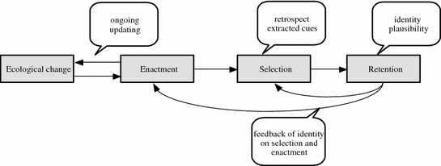

# Sensemaking

Sensemaking is "how organizational members come to understand and move forward when faced with unexpected or
unanticipated information" (Dougherty, 2020)

-   It can help stabilize the organization in time of crisis.

The difference between sensemaking theory and [Uncertainty Management Theory]: they are close ties.

+------------------------------------------------------------+---------------------------------------------------------+
| Uncertainty management Theory                              | Sensemaking Theory                                      |
+============================================================+=========================================================+
| based on individual level                                  | group dynamics and group behavior                       |
+------------------------------------------------------------+---------------------------------------------------------+
| management in relationship uncertainty                     | manage in the organizational context                    |
+------------------------------------------------------------+---------------------------------------------------------+

```{r out.width = '100%', fig.align='center', echo=FALSE}
library("jpeg")

```

(picture from [@Lu_2017])

Example in business: [@KennethWm_2014]

<br>

[@Dougherty_2004]

Culture of sexual harassment (i.e., Some cultures are more prone to sexual harassment than others).

From the perspective of sensemaking theory, organizational members make sense of unexpected events through a process of
action, selection and interpretation [@Weick_1995].

Organizational culture is created **not** through shared meaning, but **shared experiences through processes
sensemaking**. We might never come to a consensus, but the process of sensemaking can help us have shared experiences.

Properties of sensemaking:

-   Identity: created through the interaction with other organizational members.
-   Retrospective: make sense only looking backward.
-   Ongoing: relate past, present, and future to make sense of an event.
-   Enactment: actors are part of the culture.
-   Extracted cues: focus their attention to parts of the environment.
-   Social: based on either interaction with others, or expected interaction with others.
-   Plausibility: seems reasonable.

Hence, sensemaking influence

-   the acceptance of sexual harassment in an organization
-   responses by nonharassed members.

Sensemaking's phases:

-   Discovery
-   Debriefing (e.g., humor, ridicule in case of sexual harassment)
-   Dispersal (e.g., return to normalcy)

men and women make of sexual harassment differently (i.e., women label more behavior as sexual harassment than men)

Practical Applications

-   Applying Humor: humor can help members involve actively in sharing sexual harassment training, sense of community.
    But too much can also belittle victim's experience.
-   White men and sexual harassment: should to vilify, but assume that they want to help.
-   Identifying Sexual harassment: should not focus on shared meaning, but shared experience.
-   Responding to sexual harassment: no one-size-fit-all approach, but respect contexts of the sexual harassment.

<br>

[@Shenoy_Packer_2014]

First-generation immigrants are prone to microaggressions.

microaggressions are "brief and commonplace daily verbal, behavioral, or environmental indignities, whether intentional
or unintentional, that communicate hostile, derogatory, or negative racial slights and insults". [@Sue_2007]

Microagresssion exists in 3 forms:

-   Verbal: Sarcasm
-   Attitudinal: Stereotypes (e.g., not fit into stereotypes, or fit into stereotypes which dismisses individual
    achievement)\
-   Professional: Skepticism (e.g., microinvalidations when immigrant professionals' credentials and qualifications are
    challenged )

Sensemaking model by [@Weick_1995] explains how one can retrospectively make sense of past events and respond to future
events. CSM helps make sense of immigrant professional's experiences through the lenses of **power** (e.g.,
dominant-nondominant interactions).

To counter, immigrant professionals

-   create another selves

    -   muting/creating dual selves
    -   giving in
    -   giving up/ dissociating self

-   rationalizes

    -   perspective-taking
    -   blaming ignorance
    -   dismissing
    -   using humor

-   takes ownership

    -   normalizing
    -   appreciating cultural differences
    -   adapting to disparate expectation

<br>

[@Williams_2017]

Communication among stakeholders in high reliability organizations (HROs)

organizational discourse: how members make sense of the tragedy by sharing.

critical team in high-hazard organization needs effective communication processes.\
HROs are "systems that successfully operate in environments that could produce catastrophic errors."

3 broad themes from the grounded theory approach appear:

-   Emotion

    -   Some take time off to process the news.
    -   Some get back to work to cope with the events.

-   Sensemaking (why)

    -   Debriefing process to understand what happened and learn from what happened.

    -   Purpose of sensemaking:

        -   How could this have happened? This could happen to any other team. The fatal team was "unlucky".
        -   Why has this not happened to our team?

-   Learning (What now?)

    -   Individual as well as organization(structural changes) can learn

Making changes after a tragedy in the eyes of the crew was a routine event that officials make whenever a tragedy
happens regardless.

Staying away from blame\
Then the question is if you did find a person's fault led to the deaths of 19 people, we can you communicate that
knowledge to facilitate learning. Moreover, the attitude of the firefighters were reluctant to changes and went back to
the basics, maybe because of this blameless culture.Hence, people might blame luck in this situation. Interestingly,
this blameless culture also facilitate group cohesion in the HROs.

A reconciliation is to recognize hindsight bias when trying to sensemaking/learning and avoid blaming.

<br>

[@Zanin_2019]

Athletes do not report concussion readily. They often conceal it due to cultural discourses and norms.

**Cultural narratives**

Based on [@Polkinghorne_1995] two-level conceptualization of narrative: actors use narrative to create social reality
and to make sense of their experiences.

Sport narrative and sensemaking:

-   Sensemaking is the basis for social action.

    -   Sensemaking is where meanings materialize to create identity.

-   Cultural narratives help actors sensemaking by giving them a framework to understand an event.

Method: Abductive approach\
Text Arichival Data: identify protagonist, actors, storyline, story values, and morals for each story. Then, identify
sport story archetypes

Interview [[Data:\\\\](Data:){.uri}](%5BData:%5D(Data:)%7B.uri%7D){.uri} using constant comparative analysis to see how
stakeholder made sense of a concussion even and reporting behavior, then compare to the types identified in the text
archival data.

Findings:

5 narratives identified:

-   Play-Through-Pain: enduring pain for the benefits of the team.
-   Big Leagues: American Dream of becoming a professional athlete through hard work and **perseverance.**
-   Commodification: abstract objects with financial value
-   Masculine Warrior: protagonist defeats an opponent through strength, toughness, bravery, violence, and
    **perseverance**
-   Need-for-Safety: Contemporary culture where "athletes that seek healthcare are framed as moral and intelligent."

Stakeholders refer to these 5 narratives to make sense of reporting behaviors.

Sensemaking use cultural sport narrative

1.  to extract cues: whether you have a concussion or not
2.  construct identity: positive defense mechanism (4 over 5 narratives).

# Constitutive Communication of Organizations

-   Social Constructionist
-   Structuration Theory: creation and reproduction of social systems that is based on the analysis of both structure
    and agents
-   little d discourse: what happen in the conversion (i.e., representation)
-   big D Discourse; The system of expectation you

[@Schoeneborn_2017]

6 premises:

-   studies communication events (temporal and spatial dimensions).
-   Should be as inclusive as possible in its definition of (organizational) communication.
-   the co-constructed nature of (organizational) communication
-   who or what is acting is an open question
-   Communication events as unit of analysis
-   Equal importance of organizing (process) and organization (entity)

3 schools in CCO

-   Montreal School approach: (pioneered by James R. Taylor) focus on text, speech, and linguistic forms to understand
    the their organizing properties. Organization is "enacted through interaction and is related to processes of meaning
    negotiation".

    -   Cocretation: people talk $\to$ interaction
    -   Distanciation: through time, separated, distanced from the original conversation.
    -   based on actor-network theory

-   Four Flows approach (pioneered Robert D. McPhee): based on Giddens' structuration theory. Organization is created
    only when there are four flows:

    -   Membership negotiation
    -   Self-structuring: constantly structuring, self here is the organization created through interaction.
    -   Activity coordination
    -   Institutional positioning (its environment)

-   Social System Theory approach (pioneered by Niklas Luhmann): "communication constitutes systems that produce the
    very elements they consist of, in a self-referential way"

Key Questions

-   Ontological question: "what is an organization?"
-   Composition problem: "How to scale up from interaction to organization?"
-   Agency: "Who ro what is able to act on behalf of the organization?"

Critiques:

-   Bold claim that communication is organization
-   Too broad definition of communication.
-   Talk is cheap.

Emerging topics in CCO:

-   Authority (power, domination, legitimization)
-   Disordering properties of communication.

<br>

[@Bruscella_2018]

Example of Four Flows school

terrorist organizations are communicatively constituted by the way they refer to their material as evidence to their
image, existence, and legitimacy.

organization are constructed from the following communication processes:

-   **Self-structuring**: division of labor, rights and responsibility
-   **membership negotiation**: membership inclusion and exclusion criteria.
-   **activity coordination**: mutual adjustments of action
-   **institutional position**: defining the boundaries of the organization

Question of agency:

-   Four Flows theory define agency as human unique ability to make their own choice, while the Montreal School define
    agency as the ability to make a difference (e.g., humans or nonhumans). Hence, this paper included materials into
    the Four Flow Theory as the

Materials (or economics) can give inference about legitimacy, permanence, and credibility.

Hidden organization challenged the assumption of visibility from the Montreal school.

ISIL used a propaganda magazine (Dabiq) - communication- to illustrate their image and identity to its members

three communication strategies in their institutional positioning communication:

(1) instantiation: give artifacts to explain arguments.
(2) cooptation: "adoption of a rival's messaging for a purpose different from its original use."
(3) intertextual allusion: " a language form in which an association with a sacred, mythic, or origin text is insinuated
    by way of communication shortcuts."

<br>

[@Koschmann_2015]

[@Knuf_1993] defines organizational rituals "in terms of their formality, sacredness, irrationality, and aesthetics."

"what rituals do is make present an authoritative text, and how they do this is through the attribution and
appropriation of possessive constitution."

Organizations is an "abstract textual representations of power and legitimacy that are manifest in practice." Hence,
Certain kinds of interactions (i.e., organizational rituals) create organization.

Authoritative text "portrays the structure of the organization in ways that specify roles, duties, values, activities,
outcomes, and the like, while also explaining relations of power and legitimacy".

Specifically rituals found in this study:

-   The opening
-   Sharing the critter: appreciation
-   Card signing
-   Spanish lesson
-   Reciting the mission statement
-   Moment of silence

Ritual Agency

-   Rituals remind
-   Rituals discipline: instill or and constraining behavior.

Inclusion is authoritative text which constructs their organization. Hence, rituals are practices that shows inclusion.

<br>

[@Cooren_2015]

ventriloquism denotes "action through which someone or something makes someone or something else say or do things".
[@Cooren_2010]. For example, a layer is a ventriloquist while a contract is a dummy or figure.

-   Ventriloquism is bi-directionality.
-   Figure or dummy can increase ventriloquist's authority
-   communication becomes the means through which some aspects of the world contradict or align themselves with other
    aspects of the world. From a ventriloqual point of view, the world is not a place where communication is detached
    from the things that matter."

<br>

[@Trittin_2015]

Diversity in organization cannot be superficially achieved by pre-defined unchanged characteristics (i.e., gender).
Hence, in this study, authors defined diversity as "the plurality of "voices," that is, the range of individual opinions
and societal discourses that get expressed and can find resonance in organizational settings."

-   One can have many voices, and one voice can be manifested by multiple individuals.

Instrumental Perspectives on Diversity Management:

-   Traditionally, diversity was thought as the difference between individuals, where communication (unidirectional,
    controllable, and linear process of information transmission) is a moderator of diversity on performance.
-   Later, diversity as diversified value orientation [@Eastman_2003], work styles [@Shelton_2002], education background
    [@Kearney_2009].

Critical Perspectives on Diversity Management:

-   Radical -critical: you can't manage diversity in organizational settings.
-   Constructive critical: instrumental approach can be both economically successful and socially just.

This paper follows the Montreal school of thought.

# Socialization

[@Kramer_2011]

According to [@Van_Maanen_1979], socialization is defined as "the process by which an individual acquires the social
knowledge and skills necessary to assume an organizational role."

Levels of analysis:

-   Single Organization Voluntary Socialization: Individual voluntary membership:

    -   Membership negotiation

-   How individuals' multiple group memberships interact to affect their socialization

-   how the multiple group memberships of other influence the socialization process of an individual.

Personally, I'd not define the way the author structured the research as levels of analysis because they are all at the
individual level.

Personalization: new members try to change aspects of the organization to fit their needs.

Communication:

-   Reconnaissance communication: is when prospective members to obtain info about the organization.

Membership statuses are fluid, and transitory, overlapping

<br>

[@Myers_2010]

Vocational Anticipatory Socialization (VAS) tries to predict individual's interests and their career pursuit using
socialization theory.

Factors affecting the number of students choosing STEM field:

-   Social factors
-   Personal interest

Sources of VAS:

-   Family members: especially parents, socialize their children to various notions of jobs and careers.
-   Educational Institution: learn about power and social skills which later affects career choice.
-   Part-time jobs: good start for students to be socialize into the career network.
-   Peers: influence expectation of a future career.
-   Media: socialize value and expectations about careers.

Career Development Models :

1.  life-space model [@Vondracek_2019]:

-   Physiological factor (e.g., country of origin, genetics).
-   Psychological characteristics: (e.g., self-concept, development of intelligence, values, needs, interests, ability,
    aptitudes).
-   Socioeconomic environments

5 life stages:

-   Growth (0-14)
-   Exploration (15-24)
-   Establishment (25-44)
-   Maintenance (45-64)
-   Decline (after 65)

9 roles:

-   Child
-   Leisurite
-   Citizen
-   Worker
-   Pensioner
-   Spouse
-   Homemaker
-   Parent

2.  Social-cognitive career choice model: [@Lent_1994]

Self-efficacy mediate the relationship between ability and interests. A feedback loop is created once a person form
career choice goals from self-efficacy and outcome expectations

VAS differs from these two models that it studies the socializing agents.

Found both gender (even though students deny such an effect, but they admit the social effects of others) and culture
and Socioeconomic Status affect career choice. **Experience** (exposure, job shadowing), **personal factors** (i.e.,
individual-level variables) also affect career choice (consistent with social-cognitive career).

VAS Messages:

-   Value (e.g., family)
-   Expectation (e.g., self expectation of career)
-   Prescription (e.g., career choice should based on talents, interests,career's prestige and income potential )
-   Opportunity (e.g., take careers that are under pursued, hence more job opportunities).
-   Description (e.g., t job-specific environments, tasks, satisfaction, and required knowledge)

Check [@Myers_2010, pp.107] for framework of VAS in STEM.

<br>

[@smith2012]:

Master narratives should be understood in tandem with personal narratives. [@tannen2008, pp.209] defines master
narrative as "a culture-wide ideology that shapes the big-N Narrative." In contrast with small-n where it personal
stories and experiences can be found, Big-N Narratives are those that create a background for small-n narratives.

Retirement is a socialization process of the master narrative of aging and the American dream (e.g., success, and
freedom - financial, responsibility).

Groups:

-   Anticipatory group
-   Early work life
-   Preretirement
-   Retiree

Fractures of the master narrative:

-   Freedom/routine fracture: they still want some work (structure), to stay active and productive members of society
-   Individual responsibility/universal expectations fracture: individual is responsible for one's happiness.

<br>

[@ferguson2017]

[@jablin_1987] defines socialization as a "developmental unending process which can be broken up into three stages:
**anticipatory, assimilation, and exit**."

assimilation with others African American. Later on, in college, the author tried closet his identity and desire.

<br>

[@Gibson_2000]

Organizational Assimilation Processes: blue-collar usually seen as routine and repetitive, tedious hence less creative,
less motivation.

Consent that they need money and later on assimilate into the organizations. Formally, [@jablin_1987, pp.712] defines
organizational assimilation as "those ongoing behavioral and cognitive processes by which individuals join, become
integrated into, and exit organizations."

Stages of socialization:

-   Anticipatory socialization
-   encounter
-   metamorphosis: accepted into the organization, and consistent with the organization's expectation. (outgroup $\to$
    ingroup)

Concertive control is "a form of organizational control that emerges in accordance with the dominate ideologies in the
organization, usually managerial-based."

Workers construct hard-working identity and are proud of it.

# Worklife

[@Langellier_2006] Somebody's got to pick eggs - family storytelling

traditional allocation by generation and gender.

Children don't typically question their tasks. But family stroytelling "can be understood as a struggle over meanings
and material resources for family, work, and nation."

<br>

[@Kirby_2002]

using [@gidden_1984] Structuration Theory. Having a policy doesn't mean it will be enacted or practiced.

Work-Family Policy Implementation: Supervisors discourage employees to take work-family benefits

Coworker Communication: people who don't use these policies feel unjust (i.e., more work for them). Coworkers reinforce
or undermine work-family policy implementation. Employees feel resentment for those who take the leaves (there is a
sense of preferential treatment, perception of inequity).

Meritocracy plays a big role in the inequity perception.

<br>

[@Wieland_2011]

understand work and life "as a struggle through which control and resistance are accomplished as various meanings of
work are negotiated."

This study see work/life issues under the dialectical view of **control** and **resistance** (where it might not be an
individual deviance, but unobtrusive act) at Swedish organization.

2 types of "goods":

-   well-being

    -   is an end in itself

    -   is a means to an organizational end: instrumental way to achieve delivering

-   delivering

"balance" is not the solution as well-being is considered a means to an organizational end, which is parallel to
delivering.

<br>

[@D_Enbeau_2015]

Women caught in between the Western and non-Western cultures in the context of work life.

Feminine-typed careers (e.g., nursing, teaching, social work) offer lower wages, little room for growth, and long
working hours

Equity-Difference Tension:

-   Women's interpretation of religion (e.g., Muslim) to overcome their identity role.
-   Solution: Reframing Gender Difference as Gender Complementary: Women and men help each other in work-life.

Modernity-tradition Tension:

-   Traditional maternal roles: should not sacrifice work for mother role
-   Patriarchal family norms: women still honor the patriarchal role by choosing approved role set by her father.
-   Solution: Professional and familial success: you are not successful if you can't share it with your family.

Individual-Collective Tension:

-   Women in the group try to change gender norms
-   They aren't sure if they should adhere to cultural gender norms
-   Solution: cultural pride was interpreted as the reason for women to work to change collective gender norms.

<br>

[@Banghart_2018]

Boundaries can exist among:

-   private/personal
-   work/professional
-   public/political

However, these boundaries can be permeable or rigid

Increased formal social media policies (SMPs) - "when, where and how employees should engage with and communicate
through social media." [@Vaast_2013]

Boundary logics "embody the implicit and explicit organizational assumptions about the permeability or rigidity of
boundaries between personal and organizational domains."

Companies can also use

-   *evasive boundary logic*: ambiguity of boundaries serve to provide a wide range of interpretation. Hence, different
    employees have different definition of boundaries.
-   *distinct boundary logic*: how employees should conduct their social presence, where all boundaries are rigid, and
    segmentable.
-   *invasive boundary logic*: integration approach to boundary, boundaries are permeable (e.g., any messages on social
    media can reflect back on the company).
-   *contradictory boundary logic*: permeable and rigid at the same time.

Companies with general and unspecified directives can confuse and infringe upon employee rights.
