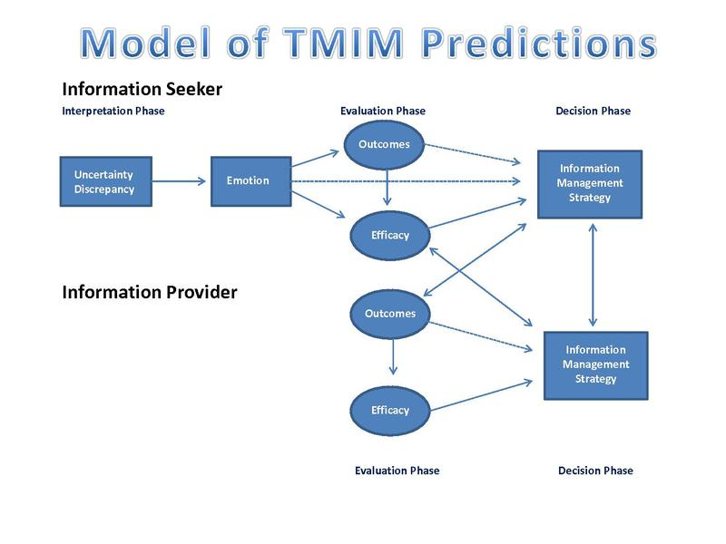

# Preface {#preface .unnumbered}

```{r, include = F}
knitr::write_bib(c(.packages(), "bookdown", "knitr", "rmarkdown"), "packages.bib")
```

<div style = "text-align: center">


</div>

```{r, out.width='25%', fig.align='center', echo=FALSE}
knitr::include_graphics('logo.png')
```


# Prerequisites

This book is based on the two communication seminars

|            Course            |    Professor     |
|:----------------------------:|:----------------:|
| Interpersonal Communication  |  Haley Horstman  |
| Organizational Communication | Debbie Dougherty |

Communication is defined as the exchange of messages.

```{r eval=FALSE}
install.packages("bookdown")
# or the development version
# devtools::install_github("rstudio/bookdown")
```

```{r include=FALSE}
# automatically create a bib database for R packages
knitr::write_bib(c(
  .packages(), 'bookdown', 'knitr', 'rmarkdown'
), 'packages.bib')
```

<!--chapter:end:index.Rmd-->

# (PART) INTERPERSONAL {-}

<!--chapter:end:02-1.Rmd-->

# Introduction {#intro}

History

-   Cornell School: study of speech from a humanities perspective
-   Midwestern School: study speech as a science

According to [@Baxter_2008], interpersonal communication is "the production and processing of verbal and nonverbal messages between two or a few persons".

Three perspectives to study interpersonal communication [@Baxter_2008]

-   [Individually Centered]
-   [Interaction/discourse Centered]
-   [Relationship Centered]

Theory and data should be an interactive process. We should understand the conceptual boundaries of a theory, we should not apply it everywhere, generously improve it or dismiss it. Usually, there aren't one ultimate theory that has its own sovereignty [@Higgins_2004]. Each theory has its own assumptions. "Making different predictions is not hte same as making competing predictions". [@Higgins_2004]. a phenomenon can be explained by multiple theories, with different reasons, which shows its robustness.

A theory must be:

1.  Testable
2.  Coherent
3.  Economical/Parsimonious
4.  Generalizable
5.  Explanability

A theory is like a child. Developing a theory is like parenting.

-   Don't abuse
-   Don't spoil
-   Knowing your theory and its limitation.

[@miller1995, pp. 5-30] Assumption of interpersonal communication: " when people communicate, they make predictions about the effects, or outcomes, of their communication behavior". Prediction can be made consciously or unconsciously; hence, communication has creative element. Two sets of factors influence prediction:

-   **situational** set: "the given, unalterable features of a communication setting".\
-   **dispositional** set: "our past experience and our future expectations dispose us to look for certain behaviors and to interpret them in certain ways".

Levels of analysis used in making prediction

1.  Cultural:

    -   culture is "the sum of characteristics, beliefs, habits, practices, and language shared by a large group of people, ". + can be either heterogeneous or homogeneous (homogeneity increases prediction accuracy).
    -   norm is "a recurrent, observable pattern", which help predict behavior
    -   ideology also helps predict responses to certain messages.
    -   prediction based on cultural data can be erroneous. The more culturally diverse a society is, the more error that you will make.

2.  Sociological:

    -   A membership group is "a class of people who share certain common, characteristics, either by their own volition or because of some criteria imposed by the predictor".

3.  Psychological

    -   Sources of behavioral differences: - learning experiences
    -   reactions to experiences
    -   perception by observers of behavior.

"Generally know a little about a great number of people and a lot about very few people"

$$
\text{Generalization}  \\
\text{Cultural} \\
\downarrow \\
\text{Sociological} \\
\downarrow \\
\text{Psychological} 
$$

"When predictions about communication outcomes are based primarily on a cultural or sociological level of analysis, the communicators are engaged in non-interpersonal communication; when predictions are based primarily on a psychological level of analysis, the communicators are engaged in interpersonal communication".

Cultural and sociological = non-interpersonal communication\
Psychological = interpersonal communication.

Stimulus generalization (may have more predictive errors) vs. stimulus discrimination.

-   We make stimulus generalization initially because it is not feasible to base our prediction on psychological data.

-   very little interpersonal communication in our society:

    -   teleological view: we should strive for interpersonal level
    -   pragmatic view: we don't need to get to the interpersonal level

-   not every communicate interpersonally in similar ways.

-   the difference between interpersonal communication and interpersonal relationships is that in interpersonal relationship, two people must be communicating interpersonally

<br>

[@wilmot1995]

There are two growth trajectories for love relationships:

-   whirlwind
-   friendship

The interpenetration of communication and relationships

-   Principle 1: Relational Definition emerge from recurring episodic enactments.

    -   An episode is "a nonverbal and verbal communication event".
    -   relational translation: attach relationship meaning to the episodes.
    -   "the more frequently a relational definition is reinforced by episodic enactments, the more potent it becomes".

-   Principle 2: Relationship Definitions "Frame" or Contextualize Communication Behavior

    -   "the meaning of our communication behaviors is dependent on the relational frame where they occur".\
    -   "communication is interpreted and associated within given relational definitions".

-   Principle 3: Relationship types are not necessarily mutually exclusive

-   Principle 4: relationship Definition and communication episodes reciprocally frame one another

<br>

**A Theory of Embeddedness**

-   Relationship Constellations

    -   definition: "interconnected networks that form patterns".
    -   the constellations influences initiating relationships by:
    -   the network we are in
    -   social norms
    -   the postilion of initiator and potential partner in the network
    -   direct action, or approval/disapproval by others in the network on your choice.
    -   density of the network also influences the overall constellation.
    -   not only actual actions by the constellation members that affect you, even your anticipation of the reaction of those members also affects you. [@Surra_1990] + people are influenced by the support or disapproval of the network
    -   "Romeo and Juliet effect": disapproval of parents strengthens relationship's bonds.

-   Cultural Considerations

<br>

**Self and Other in relation**

-   Self was defined as independent and autonomous.(e.g., in psychology mostly dysfunctionality exists mainly in self )

**Paradigm 1: The Individual Self**

Self and Others are "independent units that are connected by the relational thread." Or mere overlap of the two separate autonomous selves who just happen to have enough in common to create a relationship."

Relationship difficulties are identified by the degree of blame of the other.

Social exchange model (assume that we try to maximize profit in relationships ). Hence, we focus on building self (self-satisfaction), not relationship.

Postmodern thinking:

Constructedness: see "people as forming and reforming their selves within each relationship".

**relational self**

**Paradigm 2: The Embedded Self**

"The identity of "I" is possible solely through the identity of the other who recognizes me, and who in turn is dependent upon my recognition". (Wilber, 1932, p.272)

**The Dialectical Perspective**\
There is a dynamic interplay between opposites that we need to look at. Everything is interdependent. trade off between exactitude of factual language and seeing things in a totality way.\
External (e.g., contradiction between autonomy and integration, me vs. we, independence vs. interdependence, or expressiveness vs. protectiveness) and internal dialectical tensions in relationships

**Paradigm 3: Nonseparable self/other/relationship**

the self is the result of interaction with others.

Communication is "a conjoint reality created by two people in relation to each other"

Paradigm I \| communication is a static, linear, noninteractive event.

Transformation = Expression + Connection

[@Baxter_2004]

ground relational dialectics theory:

1.  Dialogue as constitutive process

    -   "Communication as a conduit through which a variety of antecedent psychological ans sociological factors are played out".
    -   Alternative: "Communication as constitutive": communication constitutes persons and relationships.
    -   "An individual knows self only from the outside, as he or she conceives others see him or her. The self, then, is invisible to itself and dependent for its existence on the other". Hence, self is "a fluid and dynamic relation between self and other". + self-becoming resembles self-expansion model.

2.  Dialogue as dialectical flux

    -   Dialogue is "simultaneously unity and difference". hence, social life is a dialogue "constituted in the dialectical, or contradictory, interplay of centripetal and centrifugal forces".
    -   contrast to Hegelian approach to dialogue

3.  Dialogue as aesthetic moment

4.  Dialogue as utterance

5.  Dialogue as critical sensibility

Braithwaite's Perspectives on interpersonal communication

-   Numerical Perspective
-   Situational and contextual perspective
-   Developmental Perspective
-   Levels of Info Perspective [@miller1995]
-   Relational (Stewart) focusing on the content.
-   Constitutive Approach [@Baxter_2004]

Def of IPC = when predictions about comm outcomes are based primarily on a psych level of analysis (p. 22)\
IPC occurs when:\
1. Predictions are based on personal level info\
2. Have direct experience with other person\
3. Initial interactions are rarely interpersonal\
4. Most interactions are non-interpersonal\
5. Relationships exist when both people are communicating interpersonally

Chapter 2 (Stewart (2019))

Communication is "the processes humans use to construct meaning together".

1.  Since humans live in worlds of meaning that are constantly constructed, none can affect the process significantly.
2.  Culture figures (ethnicity, gender, age, social class, sexual orientation, etc) affect communication and how you respond to it.
3.  we collaboratively build the sense of selves (i.e., identity) when engaging in communication.
4.  Conversations are a tools for communication.
5.  A useful skills in communicating is "nexting".

Communication is "the continuous, complex, collaborative, process of verbal and nonverbal meaning-making through which we construct the worlds of meaning we inhabit."

Worlds of meanings:

-   space
-   time
-   laws of physics
-   culture
-   relationships
-   work (for adults).

Interpersonal Communication:\
"people involved are contacting each other as persons"

Characteristics that distinguish persons across cultures:

-   uniqueness: noninterchangeability (either experiential or genetic)
-   unmeasurability: human can't be described by parts. even though cognitive scientists try to assign schematas or cognitive patters/ Emotions and feeling are embedded in communications.
-   Responsiveness is different from reaction.
-   reflectiveness: being aware of what's around, but also aware of your own awareness.
-   addressability: difference between talking to and talking with (i.e., addressable). directed or aimed at.

"the term interpersonal labels the kind of communication that happens when the people involved talk and listen in ways that maximize the presence of the personal".

[@Floyd_2014]

Interpersonal communication is defined as "Any communication at the intrapersonal, small group, public, or mass levels."

Boundary condition includes:

-   dyad relationships
-   "IPC as close, supportive, relationship-maintaining communication occurring between people (whether in a dyad or not")

<!--chapter:end:02.Rmd-->

# Individually Centered

## Uncertainty Management Theories

### Problematic Integration Theory

Problematic Integration (PI) theory: From the theories of planned behavior and reasoned action, we believe that we can
predict people's behaviors because people are assumed to be "rational". However, there are communication substance that
could input uncertainty and inconsistency expectations to predict human behavior.

-   Goals:

    -   find important and ubiquitous communication process
    -   increase sophistication
    -   encourage other ways of understanding
    -   increase communicators' empathy and compassion.

-   Forms of PI:

    -   Uncertainty
    -   Diverging expectations and desires
    -   Ambivalence
    -   Impossible desires (theoretical vs. practical impossibility).

-   Discussion regarding PI can deepen or hurt relationships

-   Encounter PI, we can engage in presentational and avoidance rituals.

-   PI defines uncertainty as "difficulty forming a mental association". [@Babrow_2009]

    -   form-specific adaptation of messages means "communicating in ways that speak to the precise dilemma."
        [@Babrow_2009]

### Uncertainty Management Theory

Uncertainty Management (UM)

-   Based on two post-positivist sources:

    -   Uncertainty reduction theory [@BERGER_1975]: managing uncertainty
    -   Cognitive theory of uncertainty in illness [@Mishel_1990]: depending on context, uncertainty can be either good
        or bad

-   Uncertainty must be appraised.

-   Notion of management = control

Research and practical application (e.g., health, education, )\
Evaluation: not achievable under post-positivist because of its blurry boundary conditions. But under interpretivist, it
can make more sense due to its contextual meanings.

Application:\
Taking Control: The Efficacy and Durability of a Peer-Led Uncertainty Management Intervention for People Recently
Diagnosed With HIV [@Brashers_2016]: Uncertainty management need to be adaptable. Due to the changing nature of HIV
skills and information for patients need to be communicated continuously. Supported by the theories of social support,
uncertainty management can be facilitated with peer support. participant report less illness-related uncertainty,
greater access to social support, and more satisfaction with the social support compared to the control group. **Illness
uncertainty** was assessed with [@MISHEL_1981].

Example

[@SHARABI_2017] Effects of the first FtF date on romantic relationship development:

-   Relational choice models of romantic relationships: Choosing partners that make the most sense to you (fit an image
    of an ideal mates).
-   Disillusionment models of romantic relationship: When you see other's aspects (e.g., personality, behaviors) of your
    partner, you might no longer be interested in your partner.

Predicting first date success in online dating

-   Similarity and uncertainty as predictors: users want to reduce uncertainty before meeting offline.\
-   Communication as moderating role.

Interestingly, people disclose more deeply online compared to offline [@Tidwell_2002]

### Theory of Motivated Informaiton Management (TMIM)

Born from the frustration with [Problematic Integration Theory], [Uncertainty Management Theory] interepretivist
orientation, and desire to incorporate individual experience's complexity with uncertainty and predictive specificity.

The theory has its basis on:

-   Subjective Expected Utility theory [@Fischhoff_1983]\
-   social Cognitive theory [@Locke_1987]
-   Theories of bounded rationality [@Kahneman_2003]: People make suboptimal choice due to other emotions and bias
    factors.

Due to its laborious process of decision, theory of motivated information management only applies to cases where the
person thinks a decision is sufficient important.

Phases:

-   Interpretation Phase: recognize the difference (called **uncertainty discrepancy**) in desired uncertainty and
    current uncertainty, which mostly produces anxiety, but sometimes hope, anticipation, anger.\

-   Evaluation Phase: :appraisal of uncertainty impacts assessments made in the evaluation phase", which makes you think
    about

    -   Outcome expectancy: what happen if you search for more info\

    -   Efficacy: whether you are able to do the search.

        -   Communication efficacy: whether a person has the skill to seek info.\
        -   Target efficacy: whether the target of the info search actually has and would be willing to share it.\
        -   Coping efficiency: whether a person could emotionally, relational, or financially deal with what he or she
            expects to learn.

-   Decision Phase: people are likely to seek info when they expect positive outcomes with high levels of efficacy.

```{r fig.align='center', echo=FALSE}
library("jpeg")

```

(picture from [@Baxter_2008])

Note: Information providers go through the same process with only the latter two phases (evaluation and decision).

Research and Practical Application: (e.g., education, health)

Evaluation:

-   Benefits:

    -   Draw attention to communication efficiency, and outcome expectancy
    -   Good theory: based on testability, heuristics, parsimony, scope condition

-   Improvement:

    -   may need to include efficacy's strength as mediator. Depending on the positivity or negativity of expectations.
        relationship between outcome expectancies and efficacy, and between outcome expectancies and information seeking
        may differ

Example:

[@Morse_2013] social networks and information seeking influence drug use. From Social Cognitive Theory, and Cognitive
Developmental Theory, social norms and peer influence serve as bases for aversive behaviors to be accepted. According to
[@Wolfson_2000], false consensus support can help explain students overestimate of the positive attitudes of their
social network supported by the fact that they are uncertain about their social network's opinions.

## Attribution Theory

"how and why we try to answer "how and why" questions is referred to as attribution theory" [@Baxter_2008]

originated from psychology. "The more important or unexpected the event, the more likely people are to seek an
explanation to make sense of that outcome. We make sense of such events primarily by determining what the cause is."

Goals

-   Event causation: understand actions or events by attributing cause(s) to behavior.
-   Trait inference: make inference about a person' characteristics that makes sense of that person's behavior.

Dimensions when making attributions:

-   locus: interval or external to the person
-   Stability: temporary or enduring
-   Specificity: causes is unique or universal
-   Responsibility: the extent to which a person contribute to the event

Focus on:

-   Correspondence: "When attributions are informative of a person's nature or personality, they are considered
    **"correspondent"** (i.e., we perceive that another's behavior corresponds to some underlying characteristic of who
    that person is)".

-   Covariation: "Events are attributed to causes with which they covary."

-   Responsibility: the more internal, intentional, and controllable we perceive one's behavior is, the more we hold
    that person responsible for those actions, and their consequences"\

-   Bias:

    -   "fundamental attribution bias, which is a tendency to make more internal attributions than external attributions
        for other people's behaviors" [@Ross_1977]
    -   self-serving bias: people generally make more internal, stable, and global attributions for positive events than
        for negative events, and more external attributions for negative events than for positive events [@Malle_2006]

Attribution Theory in Communication:

-   Attribution as Explanations behind social communicative actions.
-   Attribution as reason for actions and outcomes: when we think of reasons for other's communication or behaviors, it
    affects how we view others, and our communication toward them.
-   Attribution as the meanings given to a behavior: "how attributions reflect the meaning that people give to a
    communication act."

Evaluation:

-   Explanatory power: intuitive
-   Scope and generality: applicability, born as universal theory of human sense-making, but actual application was
    limited
-   Conditionship specification: strict parameters for the theory.
-   Verifiability/ Falsifiability: a lot of research supports, few say the theory is flawed.

## Social Exchange Theories

Costs vs. Rewards.

Originated from psychology, sociology, economics. Analogous to economic exchange. Under the post-positivist paradigm.

Definitions:

-   An exchange is "a transfer of something in return for something else" [@Leffler_1982]\
-   Social exchange is the result of human's connection.

| Aspect            | Social Exchange            | Economic Exchange                     |
|-------------------|----------------------------|---------------------------------------|
| Reliance          | Trust, goodwill, voluntary | Legal Obligations                     |
| Rewards and Costs | Open                       | Exact Specifications for both parties |
| Time frame        | Continuous                 | Set, fixed for the exchange to occur  |
| Type              | Unique, individualized     | Similar from person to person         |

Goals:

-   Predict and explain behaviors.

Assumptions:

-   Social behavior is a series of transactions.
-   "Individuals attempt to maximize their rewards and minimize their costs."
-   After receiving rewards, people feel a sense of obligation.

Concepts:

-   Self-interests: "individuals to act in accordance with perceptions and projections of rewards and costs associated
    with an exchange, or potential exchange, of resources." we are motivated to serve self-interests.\
-   Interdependence: "the extent to which one person's outcomes depend on another person's outcomes"

Social Exchange in Communication:

-   communication is a communication tool
-   communication is the resource to be exchange (i.e., either reward or cost).
-   Exchange may have symbolic or communication value [@Molm_2007]

Evaluation:

-   love can be selfless: **Altruism** is beyond social exchange
-   High in exchange orientation are likely to keep score [@Murstein_1971]
-   Cultures differ in their exchange orientations: exchange orientation is more expected in individualistic and
    capitalistic societies. [@Van_Yperen_1990]
-   People are not also rational (scale of inequity is not always instantly balanced)

Application:

-   emotional health (individual), trusting one's spouse (interpersonal), and **feeling underbenefited in the
    relationship (interpersonal)** significantly predict marital well-being for both groups of women (i.e., African
    American and European American). While physical health (individual) and in-law relations (social and economic)
    showed significant influence for only African American [@Goodwin_2003].

### Resource Theory

"Resources constitute rewards when they provide pleasure and costs when they provoke pain, anxiety, embarrassment, or
mental and physical effort."

Developed by [@Foa_1980; @Foa_2012]

Types of resources:

-   Money: universal
-   Goods
-   Status
-   Love
-   Services
-   Information

Exchange of similar resources results in more satisfaction [@Foa_1980]. And relationship type influences the exchange of
resources.

### Interdependence Theory

Individuals assess their rewards in a relationship based on

-   Comparison levels: what one *should* receive: "the standard an individual uses to judge how attractive or
    satisfactory a particular relationship is." Relate to **normative economics**
-   Alternatives (Comparison levels of alternatives): what one *could* receive: "the lowest level of rewards deemed
    acceptable when considering possible alternative relationship."

Note:

-   Our projection is not always right. For example, the more committed and invested we are in a relationship, the more
    likely we are to downplay alternatives [@Rusbult_2010]

Application:

-   [@Vangelisti_2013]: correlation between individuals' cognition and their relational satisfaction. Individuals'
    vocalized thoughts correlate with their partner's satisfaction.
-   equity and satisfaction (under the interdependence theory ) influences one's relational maintenance strategies
    [@Stafford_2006]

### Equity Theory

We also consider **fairness** in our equation of gains and costs, where fairness is "equity in the distribution of costs
and rewards"[@Baxter_2008].

**Distributive justice** [@Adams_1965]: "people think and act so that rewards are distributed in accordance with their
effort." Three types of inequity:

-   ratio of your rewards to costs in vs. others' ratios.
-   "the exchange relationship you and your partner have with a third entity"
-   your relationship vs others in similar situation.

Inequity leads to emotional distress [@Sprecher_2001]. Underbenefitied experiences anger, whereas overbenefited
experiences guilt. To balance our inequity, we change outcomes (perceptions), or inputs (actions)

Application:

-   Perceptions of equity influences caregiver burnout, and positive caregiver experiences [@Ybema_2002]

## Social Support Theories

Supportive communication is "verbal and nonverbal behavior produced with the intention of providing assistance to others
perceived as needing that aid." [@MacGeorge_2011, pp.317]

<!--# I don't know which sub-theories this article falls into -->

[@Afifi_2020] extended the theoretical model of communal coping. See [@Afifi_2020, pp. 426] for the TMCC model. We can
also see the definition of "communal coping."

Predictor of Coping:

-   Nature of the stressor
-   Communication quality
-   Relational quality
-   Identification with Others
-   Culture
-   Environment and Social structures

<br>

[@Brummett_2019, pp. 199] studies interracial romantic partners' expectations

<br>

Verbal person centeredness (VPC), defined as "the extent to which the feelings and perspective of a distressed other are
acknowledged, elaborated, and legitimized: [@MacGeorge_2018]. However, research sometimes use VPC for the entire
interaction, or advisors or recipients. (content focus, in constrat to non-verbal).

Person centeredness is defined as "awareness of and adaptation to the subjective, affective, and relational aspects of
communicative contexts" [@burleson_1998, pp. 249].

Dimensions of support behavior:

-   content (i.e., topical focus)

-   function (i.e., observed (inferred) intention of the provider/advisor) (e.g., describing, legitimizing, minimizing,
    recommending, justifying, blaming, criticizing, questioning, affirming, encouraging, and offering tangible support)

-   experiential focus (i.e., "the person whose experiences are being referenced in the supportive behavior"
    [@MacGeorge_2018, pp. 153]

<br>

### Dual-Process Theory of Supportive Message Outcomes

Comes from the dual-process model in psychology: "People actions are a function of the ways in which they interpret or
make sense of events." [@burleson_2010, pp.106]

Goals and Features:

-   "the impact of messages varies as a function of how those messages are processed, and it provides a detailed
    analysis of the processing modes that can be applied to supportive
    messages."[](https://www.semanticscholar.org/paper/Understanding-the-outcomes-of-supportive-A-approach-Burleson/34f073a64a9d4e5e092d816202ee415768ceb26e)

    [@Baxter_2008, pp.198]

Modes:

-   Processing modes: Elaboration (i.e., "the extent to which an individual thinks with respect to message content")

    -   negative affect

    -   motivation

    -   ability

    -   environmental cues

    -   Quality of supportive message: high vs. low

Under the framework of dual-process theory, communication is defined as "a process in which a person (the source) seeks
to convey or make public some internal state to another (the recipient) through the use of signals and symbols (the
message) in the effort to accomplish some pragmatic end (the goal)." [@burleson_2010]

Application:

-   emotional support

-   grief management

[@Davis_2018] studies the microaggression of white women towards black women with two phases:

-   Individual orientation phase (i.e., "friends communicating verbal and nonverbal messages that solely comforted the
    support seeker" - information seeking, support provision (e.g., the use of girls, hand clap))
-   Collective orientation phase (phase: Hostile differentiation, Socio-political Contextualization, Collective Uplift).

Age moderates the perceived microaggression (e.g., tolerance).

Racial microaggressions are "brief messages (i.e., verbal, nonverbal, and visual) that denigrate people of color because
they belong to a racial group that is historically oppressed in the U.S." [@Sue_2007]

<!--# when it is true microaggression, and when it's overly sensitive. I don't think you can conclusively determine -->

Strong Black Woman Collective Theory argues that "strength is valuable resource for Black women because it helps them
resist external hostilities." [@Davis_2014]

### Advice Response Theory

Social cognitive theory: how advice outcomes are influenced by qualities of messages, advisors, situations, and
recipients.

**Goals**:

ART predicts how your friend is likely to respond, based on your friend's perceptions of

1.  Message features (e.g., content and style): Recipients evaluate

    1.  message content

        -   efficacy (i.e., whether the action is likely to resolve the problem)
        -   feasibility (i.e., capacity to accomplish the action)
        -   limitation
        -   confirmation (whether the action is consistent with the recipient's intent)

    2.  Style:

        -   politeness
        -   linking
        -   respect

2.  Advisor's characteristics (likely to be mediated by message content)

    -   Expertise (to the problem)
    -   trustworthiness
    -   likability
    -   similarity (to the recipient).

3.  Situational factors (this is controversial because of conflicting empirical evidence)

    -   problem seriousness (perceived by the recipient)
    -   solution uncertainty (about how to resolve the problem)

4.  Recipient's traits or characteristic

    -   thinking style
    -   abilities (e..g, cognitive complexity)
    -   demographic (e.g., culture, gender)

<!--chapter:end:03-individually-centered.Rmd-->

# Interaction/discourse Centered

## Evolutionary Theories

theoretical framework to study biology and interpersonal communication (i.e., biosocial approach)

Some traits remain relatively stable in species.

Five principles:

1.  Basic Theory of evolution: "perpetual change in the living world where nothing is constant or repeated exactly"

2.  Common decent

3.  Multiplication of species

4.  gradualism

5.  natural selection

    1.  Individuals are variable. (i.e., variation among organism in the same familial lineage)

    2.  Advantageous traits are passed on to off-spring.

    3.  Individuals produce more offspring than the environment can support. Then, scarcity of resources kick in to
        favor individuals that have traits more advantages in acquiring resources (i.e., Adaptation), which operates at
        the genetic level (not individual).

    4.  traits are passed on gradually which lead to new species in the population

[@Tooby_2015] evolutionary psychology study the functions of brain, which is known as psychological adaptation that
evolve to solve problems in its environment.

Limitation:

-   Controversial regarding sex (i.e., biological make-up of men and women are different). Biological determinism is in
    contrast to "bi-directional nature of hormonal responses and the fact that individuals' communication can influence
    their physiological responses and vice versa."
-   Controversial over culture and individual differences:

Application:

-   [@Denes_2016] "high testosterone/no orgasm individuals may be the least likely to experience the beneficial effects
    of post sex communication."
-   [@Aloia_2014] "positive association between conflict intensity and cortisol reactivity, and this association was
    attenuated for individuals who reported higher, rather than lower, levels of childhood exposure to familial verbal
    aggression."

### Affection Exchange Theory

(AET) [@Floyd_2001] contemplates that "people give and receive affection in ways that are adaptive or evolutionarily
advantageous for their relationship." There is evidence that affection reduces stress.

Assumptions of AET:

-   procreation and survival are superodinate human goals
-   Communication helps achieve these goals (consciously or unconsciously)
-   traits that are desirable (i.e., advantageous) for superordinate goals will be passed on
-   human communicative behaviors are only partially controlled by humans.

AET's propositions:

-   "the need and capacity for affection are inborn"

    -   we don't need to learn to feel affection(i.e., innate)

    -   the need for affection is fundamental

-   "affectionate feelings and affectionate expression are distinct experiences that often, but need not, covary"

-   "affectionate communication is adaptive with respect to human viability and fertility"

-   "humans vary in their optimal tolerances for affection and affectionate behavior"

-   "affectionate behaviors that violate the range of optimal tolerance are physiologically aversive"

[@Floyd_1998] propose 3 forms of affection display:

-   Verbal communication (e.g., spoken or written)
-   Direct nonverbal (e.g., nonlinguistic or paralinguistic behaviors)
-   Indirect Nonverbal (e.g., behaviors that convey affection via social or material support)

Types of affectionate communication research:

-   Relationships: certain relationships are more affectionate than others because it relates to the relatedness of
    genes' survivability

    -   fathers gives more attention to children with higher probability to reproduce.

    -   "humans engage in affectionate behaviors, both genuinely and deceptively, within selective romantic
        relationships in order to increase relational trust, closeness, and satisfaction.", which in turn, increase
        survival and procreation.

-   Health

    -   One can have health benefits by offering affection.

    -   "highly affectionate people report higher self-esteem, general mental health, social engagement, and life
        satisfaction,a s well as lower susceptibility to depression and stress, than less-affectionate
        people"[@Floyd_2002]

Application:

[@Floyd_2009]

-   kissing improves perceived stress, relationship satisfaction, and total serum cholesterol

<br>

[@Horan_2013]

-   motivation for deceptive affection:

    -   face-saving

    -   conflict management/ avoidance

    -   emotion management

-   feelings of affection is different from communicating affection

    -   feeling affection: the feeling of warmth and fondness toward an individual

    -   communicating affection: feelings of fondness, support, and love

<br>

[@Davis_2019]

-   Controlling images (.e.g, angry black woman or mammy). Black women are thought to be self-sufficient, perseverant,
    authentic.

-   Strong Black woman collective theory: "Black women enact communication behaviors that affirm strength in each other
    ... to delineate a safe space to concurrently promote solidarity within the collective and confront oppressive
    force."

    -   Black women use "distinct communication practices (i.e., code-switching, assertive and verbal messages, and
        culturally-nuanced speech codes)"

    -   the assemblage of Black women

    -   members reinforce each others virtues of strength

    -   enable members to confront oppressive structure, but also impede vulnerability and emotionality within

-   Strength regulation like emotion regulation

-   "strength regulation contributed to more derogative comments about aggressors during supportive discussions, and
    support seekers were less satisfied in their relationships with white women after the derogative conversations"

<br>

[@Gilchrist_Petty_2019]

-   engaged-to-be-married has the highest negative attitudes regarding cross-sex best friendships.
-   attitudes toward cross-sex best friendships mediate the relationship between (how jealousy experienced and
    expressed) and (reactive jealousy experience and destructive jealousy expression)

<br>

### Tend and Befriend theory

Under the fight or flight framework, people tend to affiliate with others under stress [@Taylor_2012]. Women have
different level of fight or flight tendencies, which is due to hormones and evolutionary tendencies.

### Attachment theory

[@Bowlby_1982] As child, we form attachments to our parents, which affect how we perceive and approach relationship in
the future. Oxytocin is a hormone that facilitates social bonds [@Campbell_2010]

## Intergroup Theorizing

### Communication Accommodation Theory

Varying communicative styles are reflections of personalities, roles, temperaments, and social identities.

Communication Accommodation theory (CAT) explains why we communicate differently with different people (i.e., our
communication choices change based on the relational, identity we engage in).

Accommodation is "a process concerned with how we can reduce (and, in some cases, even magnify) communicative
differences between people in interaction" [@Baxter_2008, pp. 237]. It "enhances interpersonal similarities, and reduces
uncertainties about the other" [@Baxter_2008, pp. 237]. Speakers will be seen as more competent and credible
[@Aune_1993]. Accommodation manifests via convergence in language (i.e., dialect), nonverbal cues (e.g., speech rate,
posture) [@Li_2001]. Those with more social power are often accommodated. *(however, I think less social power should be
accommodated, for example, patients and doctors, benefactors and beneficiaries)*

Nonaccommodacaiton can signal lack of respect or liking to the other person (could be intentional or unintentional), or
authenticity. Divergence signal membership in groups, culture, and communities (their social identity).

Symmetricality and accommodation lead to strengthened interpersonal relations, and vice versa.

Principles of accommodation:

1.  Speakers will, up to an optimal level, increasingly accommodate the communicative patterns believed characteristic
    of their interactants the more they wish to

    1.  Signal positive face and empathy

    2.  Elicit the other's approval, respect, understanding, trust, compliance, and cooperation

    3.  Develop a closer relationship

    4.  Defuse a potentially volatile situation

    5.  Signal common social identities

2.  When attributed (typically) with positive intent, patterns of perceived accommodation increasingly and cumulatively
    enhance recipients'

    1.  Self-esteem;

    2.  Task, interactional, and job satisfaction;

    3.  Favorable images of the speaker's group, fostering the potential for partnerships to achieve common goals;

    4.  Mutual understanding, felt supportiveness, and life satisfaction;

    5.  Attributions of speaker politeness, empathy, competence, benevolence, and trust.

3.  Speakers will (other interactional motives notwithstanding) increasingly nonaccommodate (e.g., diverge from) the
    communicative patterns believed characteristic of their interactants, the more they wish to signal (or promote)

    1.  Relational dissatisfaction or disaffection with and disrespect for the others' traits, demeanor, actions, or
        social identities.

4.  When attributed with (usually) harmful intent, patterns of perceived nonaccommodation (e.g., divergence) will be

    1.  Evaluated unfavorably as unfriendly, impolite, or communicatively incompetent;

    2.  Reacted to negatively by recipients (e.g., recipients will perceive speaker to be lacking in empathy and trust)

CAT absorbs both interpersonal and intergroup process, even though they are considered orthogonal.

Application:

[@Chen_2016]

-   The characteristics of their communication partner (mediated by specific communication behaviors imagined by the
    participant for two of the three trait dimensions such as overaccommodation for perceptions of competence, humorous
    communication for perceptions of sociability) influences participants' stereotypes of older adult

    -   overaccommendation can be seemed patronizing, which reinforces stereotypes

-   Imagined interaction involves individuals' spontaneous thoughts regarding interpersonal communication with a real
    person, which typically occurs before an actual interaction with the person [@Honeycutt_2014].

-   based on stereotype content model (SCM), groups are stereotyped based on two dimensions: warmth and competence
    [@Fiske_2007]. Later warmth was further segmented into sociability and morality (i.e., trustworthiness)

### Communication Theory of Identity

Stem from psychology and sociology in the 50s and 60s. "Similar to the psychological tradition, the self was still most
often discussed in unitary terms with social roles reserved for the various different manifestations" [@Baxter_2008, pp.
254].

There isn't one core genuine self, but multiple selves (i.e., multiple identities). Self emerges out of one's social
interactions and the perceptions of others [@stryker1979].

Identity/Communication (identity is not separable from communication) leads to communication satisfaction.

CTI conceptualizes layers of identity as both changing and stable, and both subjective and ascribed. 4 layers are
interdependent:

-   Personal: individual, sense of self-being
-   relational: identity defined in relationship, and ascribed
-   Enacted: performance of identity, through verbal and nonverbal messages
-   Communal: how society defines identity and identities (i.e., group membership)

The gap between personal and enacted identities is called identity gaps [@Jung_2004], leads to negative psychological
outcomes (e.g., depression). But it could also help individual try to close the gap (cognitive dissonant).

We want others to value the same attributes that we ourselves value [@Baxter_2008, pp. 261]

<br>

#### Application

[@WILLER_2010]

-   Socially aggressive face threats (SAFTs) are "messages that threaten one's identity or positive face"

-   social aggression can damage self-esteem, social standing.

-   Face is the self or image that people present and expect others to main or support during interaction
    [@Cupach_1994], which includes two desires:

    -   positive face needs: desire for approval, appreciation, and liking

    -   negative face needs: desires for freedom from action ad imposition

-   and two threats

    -   positive face threats: similar to socially aggressive messages. Hence, the authors use the terms SAFTs.

-   Negative affect negatively associated feelings of forgiveness (measured by feelings of revenge and avoidance,
    avoidance)

<br>

[@Nuru_2014]

-   transgender is when "self-identify with a gender that ''contradicts'' socially acceptable gender roles and
    expectations as dictated by external genitalia and assigned birth sex."

    -   "any divergence from conventional social norms that tie gender identity to role expectancy and biological sex"
        [@Bornstein_2013]

-   Gender identity may overlap sexuality, they are two distinct processes of negotiation.

-   Genital sex can differ from social and psychological gender.

-   Gaps between personal, enacted, and relational layers are prevalent.

-   Strategies to mitigate tension:

    -   Closeted enactment

    -   disengagement

    -   passing: intentional disguise to preserve relationship

    -   label changing

<br>

[@Harris_2018]

-   In the context of bullying, studies have traditionally been White-oriented. Hence, there is a need for diverse
    sampling.

-   Due to political climate in 2016, students are reported to be more anxious and new wave of political bullying was on
    the rise.

-   race is a social construct that relates to power, privilege, and systemic oppression. racist draw societal power
    from being members of the majority group. Racism is different from racial prejudice and racial discrimination (i.e.,
    everybody can be racially prejudice, but only macro culture members can be racists).

-   Bullying can happen between group (macro vs. micro cultures), and within group (in-group bullying, i.e., Mexican
    American and Mexican immigrants).

-   Marginalized status triggers victim status

    -   family socioeconomic status (SES) and test scores are correlated

-   Intersectioanality and Race in Bullying

<br>

## Critical Approaches to IPC Research

List of interpersonal communication theories under critical approaches:

-   Relational dialectics Theory
-   Narrative performance Theory
-   Family of Feminist theories

Difference between postmodern critical approach and modern tradition is how power is conceptualized, but both agree that
power has impact on communicative life with the goals of emancipation and empowerment.\
Critical modern hope to free people from socially oppressed system, but postmodern critical scholars view the world as
constant struggle for dominant discourses.

Power definition:

-   Post-positivistic tradition: "as an individual level variable based on the various kinds of resources the individual
    posses" (Berger, 1994).
-   modern critical: "as a systemic construct that exists external to the individuals who operate within those systems."
    [@Baxter_2008, pp. 273]

Critical Modern Tradition:

-   False consciousness: lack of awareness of constraints imposed by system (Pine, 1993).

-   goal: dismantle false consciousness to free people

-   Communication is a reflection of systematic constraint

-   Application:

    -   Gender as a social system, gender is a range of ideals (masculine and feminism).

    -   Relational Labor as a social system

Postmodern Tradition

-   Resist thinking of power as top-down, and advocate for power is bottom-up-and-out dynamics and power is constantly
    met with resistant, which means it is unstable and fluid.

-   Comminciaiton is the social world (not a reflection of it).

-   Application:

    -   Uncertainty as positive precondition for change

    -   Self-making instead of Self-disclosure: individuals are not intact.

To evaluate critical approaches to interpersonal communication, we need to consider:

-   ethics: (1) how your position impacts what is identifiable, and that which is beneficial
-   change: can your change emancipate the marginalized and oppressed?

## Critical Feminist Theories

-   Feminist Theories

    -   "Feminism" is "defined as the belief that men and women are equal and should have equal rights and
        opportunities in all spheres of life---personal, social, work, and public". [@Baxter_2008, pp. 290]

        -   Gender (different from sex): social meaning attached to biological distinct, which is embedded in
            communication

        -   Patriarchy: " a system that reflects primarily the interests, values, perspectives, and experiences of men,
            as a group." [@Baxter_2008, pp. 290]

-   Critical Theories:

    -   "identify prevailing structures and practices that create or uphold disadvantage, inequity, or oppression, and
        to point the way toward alternatives that remote more egalitarian relationships, groups, and societies.
        [@Baxter_2008, pp. 292]

-   The production of the two theories:

    -   The recursive relationship between how cultural structures and practices differently and inequitably shape
        women's and men's lives and communication practice and vice versa.

-   Assumptions:

    -   "members of groups defined by sex, race, and other factors occupy distinct positions in a society - those are
        their social location."

-   Methodological Implication: examination of power that is both formal and informative ones.

-   Power:

    -   in relation to unequal status, privilege.

-   Communication: with less communication on a subject, we'd have less knowledge of it, or even notice it.

    -   Hence, we should name and increase social awareness of women's experiences.

-   Examples

    -   Sexual harassment

    -   Date rape

    -   Marital rape

    -   Second Shift

    -   Conversational maintenance work

-   Evaluation:

    -   Parsimonious: few concepts (gender, power, dominance).

    -   Limited explanability since it focuses on sex and gender, and limited utility: small subset of people.

Application:

[@Sanford_2019]

-   Based on Co-Cultural Theory, the authors found that even when they constitute a large part of an institution's
    population, Hispanic students still feel the need to behave under White norms (assimilationist strategies).

<br>

[@Ross_2016]

-   Modification s to office logistic and and practitioners' behavior can increase a healthy communication environment
    among trans-patient-practitioner

<br>

[@Nuru_2018]

-   memorable messages about race:

    -   denial of racism

    -   preparation for bias

    -   promotion of mistrust

-   these memorable message help make sense of racial hierarchies in Cost Rica and racial socialization in the global
    contexts.

<br>

[@Suter_2017]

Critical Interpersonal and Family Communication framework should consider:

-   power
-   bi-directionality between private and public realms
-   critique/resistance/transformation of the status quo in the service of social-justice ends
-   author reflexivity

"(a) What is my impetus for speaking and writing? (b) Where am I speaking from? (c) To whom am I accountable in this
process? (d) What are the potential material and discursive effects resulting from my speaking and writing" (Yep, 2010,
p. 173)

<!--chapter:end:04-interaction-centered.Rmd-->

# Relationship Centered

## Affection Exchange Theory

## Transnational Scholarship

## Resilience Communication Theories

[@Buzzanell_2010]

-   Human resilience is "the ability to "bounce back" or reintegrate after difficult life experiences"

-   Resilience is not possessed by individual but by discourse, interaction, and processes:

    -   crafting normalcy

    -   affirming identity anchors:

        -   identity anchor is "a relatively enduring cluster of identity discourses upon which individuals and their familial, collegial, and/or community members rely when explaining who they are for themselves and in relation to each other."

    -   maintaining and using communication networks

        -   Social capital is important in time of need

    -   putting alternative logics to work

    -   downplaying negative feelings while foregrounding positive emotions

-   [@Richardson_2002] defines resilience as "the process of reintegrating from disruptions in life"

    -   requires "trigger event"

<br>

[@AFIFI_2016]

-   Theory of resilience and relational load (TRRL) in the context of social

    -   based on theory of

        -   emotional capital

        -   adaptive calibration model, allostatic load, investment model, family systems theory, affectionate exchange theory, broaden and build theory

    -   Assumptions

        -   people want to feel validated and secure, based on sociometer hypothesis, intergroup theories, social identity theory, evolutionary theories (e.g., exchange theory).

        -   stress is natural and necessary (either good or bad).

            -   good stress = positive perception of stressors

            -   bad stress = distress = negative perception of stressors

        -   body and mind work together to cope with stress

        -   body has a natural diurnal rhythm

        -   relationship have homeostasis that is "continually being calibrated in response to stress and the communication of stress."

    -   Propositions:

        -   "Validating communicative maintenance behaviors and actions over time build positive emotional reserves. Emotional reserves reflect the accumulation of investments (i.e., maintenance) and discrepancies in investments"

        -   Communal orientation & discrepancies influence communication maintenance behaviors/discrepancies, and vice versa

        -   Communal orientation, emotional reserves, discrepancies in the communal orientation influence how one perceives stressors, which later influence their investment in the relationship

        -   communal orientation and emotional reserves, discrepancies int eh communal orientation influence threat and security-based appraisals and communication pattern

            -   Similar constructs to communal orientation are cognitive interdependence, couple identity, communal coping

            -   self-control could be depleted

        -   continued depletion of resources and increased stress increase relational load

        -   short-term depletion and relation load have short-term and long-term health consequences respectively.

        -   "Security-based appraisals and communication patterns facilitate resilience, the potential to thrive, and short-term and long-term health"

        -   Communicative maintenance strategies can be learned

-   Resilience is "the ability to adapt positively when confronted with adversity or stress" [@2003_3713]

-   positive *relationship maintenance* can serve as resilience in close relationships, via

    -   nonverbal behaviors

    -   perceptions


Picture from **Personal Relationships, Volume: 23, Issue: 4, Pages: 663-683, First published: 26 October 2016, DOI: (10.1111/pere.12159)**

<br>

[@Buzzanell_2018]

Resilience include:

-   Individual/relational resilience: social relationship can increase adaptive ability to adversity. To increase one's resilience

    -   giving and receiving affection

    -   exchanging person-centered messages

    -   being present

-   family resilience

    -   parent-child (dyadic) can foster resilience

-   organizational resilience

    -   5 tensional processes

-   community resilience

    -   bouncing forward = interactional process that helps individuals to adapt successfully to changing circumstances

-   national resilience

    -   resilience is defined by Hamilton Bean as a "central trope", "shared social phenomenon" that solidify "shared feelings of resoluteness."

<br>

[@Kam_2018]

-   How undocumented youth cope with stress at the family level

-   Resilience is "the process by which individuals exposed to adversity exhibit positive adaptation in spite of this adversity." It is a general pattern or process than a trait or quality.

-   To cope with stress, youths use strategies:

    -   psychological suppression

    -   distraction/diversion

    -   reframing

    -   normalizing

-   The individual as an asset

-   The family as a resource

-   Stress come from

    -   unable to go places, unable to attend college, employment, help family financially, affordable health care

    -   fear of detainment/deportation

<br>

[@First_2020]

-   Covid-19 exposure directly influence stress, and indirectly influence stress and depress through media use and interpersonal communication.

## Communication Privacy Management Theory

-   CPM is under a boarder context as compared to only disclosure. It's the dialectical tension of private information between revealing and concealing under a rule management system.

-   Guiding maxims:

    -   Assumption maxims:

        (1) public-private dialectical assumptions: dialectical nature of revealing and concealing

        (2) privacy management assumptions:

            -   We are entitled to our private information
            -   people should control the flow of private information
            -   managing private information is not absolute

        (3) boundary metaphor assumptions

    -   Axiomatic maxims:

        (1) Conceptualizing private information ownership: one can be authorized, or unauthorized co-owners of information.

        (2) conceptualizing private information control: privacy rules are applied based

            (1) core criteria: culture, gender, privacy orientations
            (2) catalyst: privacy rules adapt to changes.

        (3) conceptualizing private information turbulence: gossip breaks privacy

    -   Interaction maxims:

        (1) shared privacy boundaries: there is a boundary around the shared information.

        (2) coordinating privacy boundaries: co-own, co-manage, 3 operations:

            (1) privacy boundary linkages: alliances between a discloser and recipients

            (2) private information co-ownership rights: privileges and expected responsibility for co-owners of private information.

            (3) privacy boundary permeability: the amount of openness within a privacy boundary. managed boundary in

                (1) disproportionate way
                (2) intersected way
                (3) Unified way

        (3) ramifications of privacy boundary turbulence

-   Application:

    -   [@Petronio_2007]: translational aspect
    -   [@Bute_2017]: Orgasm and alcohol on communication after sexual activity.\
    -   [@Brummett_2014]: interracial partners disclose relational information to social network members. They both experience power struggles while managing private and relational information.
    -   [@Denes_2014]: miscarriages are bound by societal-level expectations about how they should be talked in interpersonal communication.

## Relational Turbulence Theory

-   Relationship progresses in two ways

    -   Qualitative change perspective: sudden tranformational change

    -   Quantitative change perspective: incremental shifts

-   causes of relational turbulence during times of transition

    -   relational uncertainty ,from emotion-in-relationships model, refers to "degree of confidence (or lack of confidence) that individuals have in their judgments about the nature of their relationship." [@Baxter_2008, .pp521]

        -   Consists of

            -   Self uncertainty

            -   Partner uncertainty

            -   Relationship uncertainty

    -   Interference from partners: from emotion-in-relationships model, consists of

        -   Inference from partners

        -   Facilitation from partners

-   Under relational turbulence, people use both avoidant and aggressive messages [@Baxter_2008, .pp523]. It changes the message processing and message production mechanisms.

-   This theory can be applied to a broad range of contexts from couples, parents, military personnel, etc.

-   Applications:

    -   [@Solomon_2016]

    -   [@Theiss_2013]

    -   [@Tian_2020]

    -   [@Harvey_Knowles_2015]

[](https://onlinelibrary.wiley.com/doi/epdf/10.1111/hcre.12091)

[@Solomon_2016, pp.509]

<!--chapter:end:05-relationship-centered.Rmd-->

# (PART) ORGANIZATIONAL COMMUNICATION {-}

<!--chapter:end:10-1.Rmd-->

# Perspectives on Organizational Communication


<br>


[@Mumby_1996]
Organizational communication as a discipline can be looked under the framework of 4 problematics.  

The problematic of:  

 1. voice: characterized by multiple voices, not only managerial.  
        + organizational communication cultivates tensions between university and firms, rather than resolving it.  
        + how voices can gain insight into marginalized groups.  
 2. rationality  
        + pluralist understandings 
        + technical rationality: "knowledge that privileges a concern with prediction, control and teleological forms of behavior".  
        + Practical rationality: "knowledge grounded in the human interest in interpreting and experiencing the word as meaningful and intersubjectively constructed"  
 3. organization  
        + The question of organization is fundamental in organizational communication.  
        + the complex structure of organizing, culture and larger social processes.  
 4. organization-society relationship  
        + organizational boundaries (separation between organization and society) cannot be clearly defined due to its fluid nature.  
        + can study the dynamics nature of globalization.  
        + communication is not just information exchange, but it is the core of organizing where organization structure is dynamically created.  


<br>

[@Broadfoot_2007]  
We might have been myopic when only interpret and look at organizational communication from the perspective of Euro-American intellectual tradition. hence, we need to have alternative, rationalities, and perspectives.  

Due to [@Mumby_1996], there are four major problematics in organizational communication:  

 * Voice: who gets to speak for whom  
 * Rationality: 2 forms of rationalities: technical/instrumental and practical and the consequences.   
 * Organization: members create meaning through communication.   
 * Organization-society relationship: it's hard to distinguish between the two, hence we should study in conjunction.    

there is a new shift to the non-American voices: A Postcolonial awakening.  

Postcolonial self-reflexivity: a resistance from Eurocentric perspective.  


<br>


[@Shome_1996] defines Discursive confinement as "a state where difference and individuality are eased or neutralized and scholars become confined to a narrow and marginalized discursive space constructed by dominant mainstream structures and ideologies". Hence, we should break through the discipline and embed individuality through emotionality.  

We can see the shift in areas such as gender, race, and globalization.  

A postcolonial exploration: different perspective can contribute richly to the understanding organizational communication.  


<br>

[@Cheney_2007]


Identity: from business. flow of information between stakeholders.  

Breaking boundaries: expand to other issues such as informal network, social movements, etc.

Opportunities from social problems: shift from basic research to focus on society and planet.  

Ethos and Confidence: The discipline of organizational communication as well as communication are constantly in need to prove for its legitimacy.  

Audiences: various outlets, but mostly focus on research publication due to the need for tenure.  

To get beyond the pressure for tenure, the author suggests:  

 * choose an issue that you care.  
 * listen/read well from various perspectives   
 * choose appropriate outlets.  
 * set everyday goal.  
 * practice what you preach  
 * lead by example  
 * do not give up  
 * pause and reflect.  


[@DUrso_2014]

History (genealogy) of organizational communication with the method of network analysis.  

Author posted several research questions that could use the network analysis method to probe into such as collaboration and coauthorship, and overall development of organizational communication.  

<br>


[@Leonardi_2016]

the strategy of subordination taken by organizational communication researchers are those that look at a phenomena from the perspective of organizational communication, which leads to small contribution to the literature.  


To know if a one owns a phenomenon is when people know to turn to you when they wan to understand such phenomenon .  


### Strategy of Discovery

2 steps:  

 1. Phenomenon is communication  
 2. What communication does and why  

### Strategy of Reconceptualizatinon

2 steps:  

 1. Contradictory evidence or poor explanation  
 2. Communications leads to better fit (e.g., accuracy or novelty)  


<br>


# Organizational Culture

[@Martin_1983]

Culture:  

 * based on history, members can behave and expected to behave  
 * help construct common value for employees.  
 * control mechanisms which dictate patterns of behavior  


culture can hardly be under control, not monolithic phenomenon


3 levels of culture:  

 + basic assumptions  
 + values/ideology  
 + artifacts (e.g., stories, rituals, dress): express values  
 + management practices (e.g., training program).  

Types of subcultures:  

 + enhancing: same position  
 + orthogonal: unrelated position  
 + counterculture: opposite position: "most likely to arise in a strongly centralized institution that has permitted significant decentralization of authority to occur"  (e.g., GM's culture: team players, loyalty, "refrigerator story"), balancing act must be taken to manage counter culture and dominant culture


<br>

[@Dixon_2009]
multiple meanings of organizational culture  

Consulting method: in-depth and focus group interviews with student staff, artifact analysis, and observation of organization staff meetings and retreats  

Common terms did not mean the same thing.  2 different fields: organizational communication, and higher education.  

 * Organization culture: "German approach, based in phenomenological/Interpretive epistemology". culture is the product of symbolic interaction. Scholars tries to understand the role of human interaction.  organizational culture is not easily manipulated by managers. " organization is a culture". purposes:  
        + increasing productivity  
        + understanding organizational processes  
        + critiquing oppressive organizational practices.
 * organizational culture: American  approach to study organizational variable that affect  organizational effectiveness. "organization has a culture". can be quantified, and manipulated.   
        + Institution can be measured: dynamism vs. stability and internal vs. external focus.  

two subculture: First-born (tradition, consensus) and Youngest (debate, and new ideas)

The problem stems from different discipline understanding of "culture", there was a rejection of the definition by organizational communication scholars. 

" Rather than positing that there is one right concept, we would encourage other consultants to proactively discuss with clients, what key terms mean to them in the particularity of their context, as a means of creating a shared discursive reality."

<br>

[@Leonardi_2008]
mergers between two technology companies 

cultural studies of postmerger integration 

A core technology is "the primary technology produced, serviced, or sold by an organization".

technological grounding suggests that "an organizations core technologies are, along with the work and communication practices enacted daily by members, a constitutive feature of its culture"  

two dominant perspectives for understanding culture that exist in organizational literature:  

 * as a variable that can be changed.  
        + technology is a variable . The two variables are distinct and can be either internal or external based on researchers' perspective.  
 * culture is organization.  
        + in postmerger, organizations face cultural convergence. 
        + technology is not a variable but a practice. 
        + "When technologies are sufficiently important to an organization to become key elements in the constitution of a culture, we refer to that organization as technologically grounded. " (a continuum not dichotomy).  
        + "technological incompatibility implies the incompatibility of organizational cultures and practices"

Method:  a single case design, embedded design:  

levels of analysis  
 (1) public discourse from company officials about the merger, 
 (2) organizational practices and policies before and after the merger 
 (3) worker responses during postmerger integration


US West built its culture on the West culture use analog data  
Qwest built its culture on speed  use digital data (all internet protocol - IP)  

Qwest consumed US West's culture (e.g., bureaucracy) due to its  technological superiority and cultural superiority in postmerger integration

Qwest shut down US West's Research Labs. 


## 4

Chapter 4: Communicating Organizational Culture: A Problem-Solving Model. 

Communication: is about creating message, production and reproduction of meaning.   

Organizations are communication.  

Gestalt Theory (figure and ground): sometimes the important part is thought of as the background   

Organizational culture is an active process that shape organizations.   

organizational culture is defined "as the shared communicative process through which meanings are constantly employed, negotiated, and contested to create a stable communication environment within which organizational life becomes patterned and persistent over time."

organizational cultures does not mean shared meaning but **shared process of meaning making**. 


Forms of communication:   

 * info sharing  
 * message production  
 * meaning making  


organizational values as "those things, standards, and ideals through which we evaluate our organizational wellbeing".   

Types of values:  

 * Personal values  
 * Moral values  
 * Aesthetic values  
 * Status values: power allocation.    
 
 Organizational meanings  
 
  * Cognitive meanings  
  * Emotional meanings: people might mistakenly consider irrationality as emotionality.    
  * Social meanings  sensemaking theory  
  * Identity meanings  cultural contract theory of identity. 3 types of cultural contracts:  
        + ready-to-sign contracts: assimilation (physical, behavioral,a nd mental assumption of dominant culture).  
        + Quasi-completed contracts: allows adaption  
        + Cocreated contracts: mutual valuation.  
  * Power meanings  
        + can derived from formal hierarchy  
        + or from relationships (as opposed to isolation).  


<!--chapter:end:10.Rmd-->

# Sensemaking

Sensemaking is "how organizational members come to understand and move forward when faced with unexpected or
unanticipated information" (Dougherty, 2020)

-   It can help stabilize the organization in time of crisis.

The difference between sensemaking theory and [Uncertainty Management Theory]: they are close ties.

+------------------------------------------------------------+---------------------------------------------------------+
| Uncertainty management Theory                              | Sensemaking Theory                                      |
+============================================================+=========================================================+
| based on individual level                                  | group dynamics and group behavior                       |
+------------------------------------------------------------+---------------------------------------------------------+
| management in relationship uncertainty                     | manage in the organizational context                    |
+------------------------------------------------------------+---------------------------------------------------------+

```{r out.width = '100%', fig.align='center', echo=FALSE}
library("jpeg")
knitr::include_graphics('images/Sensemaking.png')
```

(picture from [@Lu_2017])

Example in business: [@KennethWm_2014]

<br>

[@Dougherty_2004]

Culture of sexual harassment (i.e., Some cultures are more prone to sexual harassment than others).

From the perspective of sensemaking theory, organizational members make sense of unexpected events through a process of
action, selection and interpretation [@Weick_1995].

Organizational culture is created **not** through shared meaning, but **shared experiences through processes
sensemaking**. We might never come to a consensus, but the process of sensemaking can help us have shared experiences.

Properties of sensemaking:

-   Identity: created through the interaction with other organizational members.
-   Retrospective: make sense only looking backward.
-   Ongoing: relate past, present, and future to make sense of an event.
-   Enactment: actors are part of the culture.
-   Extracted cues: focus their attention to parts of the environment.
-   Social: based on either interaction with others, or expected interaction with others.
-   Plausibility: seems reasonable.

Hence, sensemaking influence

-   the acceptance of sexual harassment in an organization
-   responses by nonharassed members.

Sensemaking's phases:

-   Discovery
-   Debriefing (e.g., humor, ridicule in case of sexual harassment)
-   Dispersal (e.g., return to normalcy)

men and women make of sexual harassment differently (i.e., women label more behavior as sexual harassment than men)

Practical Applications

-   Applying Humor: humor can help members involve actively in sharing sexual harassment training, sense of community.
    But too much can also belittle victim's experience.
-   White men and sexual harassment: should to vilify, but assume that they want to help.
-   Identifying Sexual harassment: should not focus on shared meaning, but shared experience.
-   Responding to sexual harassment: no one-size-fit-all approach, but respect contexts of the sexual harassment.

<br>

[@Shenoy_Packer_2014]

First-generation immigrants are prone to microaggressions.

microaggressions are "brief and commonplace daily verbal, behavioral, or environmental indignities, whether intentional
or unintentional, that communicate hostile, derogatory, or negative racial slights and insults". [@Sue_2007]

Microagresssion exists in 3 forms:

-   Verbal: Sarcasm
-   Attitudinal: Stereotypes (e.g., not fit into stereotypes, or fit into stereotypes which dismisses individual
    achievement)\
-   Professional: Skepticism (e.g., microinvalidations when immigrant professionals' credentials and qualifications are
    challenged )

Sensemaking model by [@Weick_1995] explains how one can retrospectively make sense of past events and respond to future
events. CSM helps make sense of immigrant professional's experiences through the lenses of **power** (e.g.,
dominant-nondominant interactions).

To counter, immigrant professionals

-   create another selves

    -   muting/creating dual selves
    -   giving in
    -   giving up/ dissociating self

-   rationalizes

    -   perspective-taking
    -   blaming ignorance
    -   dismissing
    -   using humor

-   takes ownership

    -   normalizing
    -   appreciating cultural differences
    -   adapting to disparate expectation

<br>

[@Williams_2017]

Communication among stakeholders in high reliability organizations (HROs)

organizational discourse: how members make sense of the tragedy by sharing.

critical team in high-hazard organization needs effective communication processes.\
HROs are "systems that successfully operate in environments that could produce catastrophic errors."

3 broad themes from the grounded theory approach appear:

-   Emotion

    -   Some take time off to process the news.
    -   Some get back to work to cope with the events.

-   Sensemaking (why)

    -   Debriefing process to understand what happened and learn from what happened.

    -   Purpose of sensemaking:

        -   How could this have happened? This could happen to any other team. The fatal team was "unlucky".
        -   Why has this not happened to our team?

-   Learning (What now?)

    -   Individual as well as organization(structural changes) can learn

Making changes after a tragedy in the eyes of the crew was a routine event that officials make whenever a tragedy
happens regardless.

Staying away from blame\
Then the question is if you did find a person's fault led to the deaths of 19 people, we can you communicate that
knowledge to facilitate learning. Moreover, the attitude of the firefighters were reluctant to changes and went back to
the basics, maybe because of this blameless culture.Hence, people might blame luck in this situation. Interestingly,
this blameless culture also facilitate group cohesion in the HROs.

A reconciliation is to recognize hindsight bias when trying to sensemaking/learning and avoid blaming.

<br>

[@Zanin_2019]

Athletes do not report concussion readily. They often conceal it due to cultural discourses and norms.

**Cultural narratives**

Based on [@Polkinghorne_1995] two-level conceptualization of narrative: actors use narrative to create social reality
and to make sense of their experiences.

Sport narrative and sensemaking:

-   Sensemaking is the basis for social action.

    -   Sensemaking is where meanings materialize to create identity.

-   Cultural narratives help actors sensemaking by giving them a framework to understand an event.

Method: Abductive approach\
Text Arichival Data: identify protagonist, actors, storyline, story values, and morals for each story. Then, identify
sport story archetypes

Interview [[Data:\\\\](Data:){.uri}](%5BData:%5D(Data:)%7B.uri%7D){.uri} using constant comparative analysis to see how
stakeholder made sense of a concussion even and reporting behavior, then compare to the types identified in the text
archival data.

Findings:

5 narratives identified:

-   Play-Through-Pain: enduring pain for the benefits of the team.
-   Big Leagues: American Dream of becoming a professional athlete through hard work and **perseverance.**
-   Commodification: abstract objects with financial value
-   Masculine Warrior: protagonist defeats an opponent through strength, toughness, bravery, violence, and
    **perseverance**
-   Need-for-Safety: Contemporary culture where "athletes that seek healthcare are framed as moral and intelligent."

Stakeholders refer to these 5 narratives to make sense of reporting behaviors.

Sensemaking use cultural sport narrative

1.  to extract cues: whether you have a concussion or not
2.  construct identity: positive defense mechanism (4 over 5 narratives).

# Constitutive Communication of Organizations

-   Social Constructionist
-   Structuration Theory: creation and reproduction of social systems that is based on the analysis of both structure
    and agents
-   little d discourse: what happen in the conversion (i.e., representation)
-   big D Discourse; The system of expectation you

[@Schoeneborn_2017]

6 premises:

-   studies communication events (temporal and spatial dimensions).
-   Should be as inclusive as possible in its definition of (organizational) communication.
-   the co-constructed nature of (organizational) communication
-   who or what is acting is an open question
-   Communication events as unit of analysis
-   Equal importance of organizing (process) and organization (entity)

3 schools in CCO

-   Montreal School approach: (pioneered by James R. Taylor) focus on text, speech, and linguistic forms to understand
    the their organizing properties. Organization is "enacted through interaction and is related to processes of meaning
    negotiation".

    -   Cocretation: people talk $\to$ interaction
    -   Distanciation: through time, separated, distanced from the original conversation.
    -   based on actor-network theory

-   Four Flows approach (pioneered Robert D. McPhee): based on Giddens' structuration theory. Organization is created
    only when there are four flows:

    -   Membership negotiation
    -   Self-structuring: constantly structuring, self here is the organization created through interaction.
    -   Activity coordination
    -   Institutional positioning (its environment)

-   Social System Theory approach (pioneered by Niklas Luhmann): "communication constitutes systems that produce the
    very elements they consist of, in a self-referential way"

Key Questions

-   Ontological question: "what is an organization?"
-   Composition problem: "How to scale up from interaction to organization?"
-   Agency: "Who ro what is able to act on behalf of the organization?"

Critiques:

-   Bold claim that communication is organization
-   Too broad definition of communication.
-   Talk is cheap.

Emerging topics in CCO:

-   Authority (power, domination, legitimization)
-   Disordering properties of communication.

<br>

[@Bruscella_2018]

Example of Four Flows school

terrorist organizations are communicatively constituted by the way they refer to their material as evidence to their
image, existence, and legitimacy.

organization are constructed from the following communication processes:

-   **Self-structuring**: division of labor, rights and responsibility
-   **membership negotiation**: membership inclusion and exclusion criteria.
-   **activity coordination**: mutual adjustments of action
-   **institutional position**: defining the boundaries of the organization

Question of agency:

-   Four Flows theory define agency as human unique ability to make their own choice, while the Montreal School define
    agency as the ability to make a difference (e.g., humans or nonhumans). Hence, this paper included materials into
    the Four Flow Theory as the

Materials (or economics) can give inference about legitimacy, permanence, and credibility.

Hidden organization challenged the assumption of visibility from the Montreal school.

ISIL used a propaganda magazine (Dabiq) - communication- to illustrate their image and identity to its members

three communication strategies in their institutional positioning communication:

(1) instantiation: give artifacts to explain arguments.
(2) cooptation: "adoption of a rival's messaging for a purpose different from its original use."
(3) intertextual allusion: " a language form in which an association with a sacred, mythic, or origin text is insinuated
    by way of communication shortcuts."

<br>

[@Koschmann_2015]

[@Knuf_1993] defines organizational rituals "in terms of their formality, sacredness, irrationality, and aesthetics."

"what rituals do is make present an authoritative text, and how they do this is through the attribution and
appropriation of possessive constitution."

Organizations is an "abstract textual representations of power and legitimacy that are manifest in practice." Hence,
Certain kinds of interactions (i.e., organizational rituals) create organization.

Authoritative text "portrays the structure of the organization in ways that specify roles, duties, values, activities,
outcomes, and the like, while also explaining relations of power and legitimacy".

Specifically rituals found in this study:

-   The opening
-   Sharing the critter: appreciation
-   Card signing
-   Spanish lesson
-   Reciting the mission statement
-   Moment of silence

Ritual Agency

-   Rituals remind
-   Rituals discipline: instill or and constraining behavior.

Inclusion is authoritative text which constructs their organization. Hence, rituals are practices that shows inclusion.

<br>

[@Cooren_2015]

ventriloquism denotes "action through which someone or something makes someone or something else say or do things".
[@Cooren_2010]. For example, a layer is a ventriloquist while a contract is a dummy or figure.

-   Ventriloquism is bi-directionality.
-   Figure or dummy can increase ventriloquist's authority
-   communication becomes the means through which some aspects of the world contradict or align themselves with other
    aspects of the world. From a ventriloqual point of view, the world is not a place where communication is detached
    from the things that matter."

<br>

[@Trittin_2015]

Diversity in organization cannot be superficially achieved by pre-defined unchanged characteristics (i.e., gender).
Hence, in this study, authors defined diversity as "the plurality of "voices," that is, the range of individual opinions
and societal discourses that get expressed and can find resonance in organizational settings."

-   One can have many voices, and one voice can be manifested by multiple individuals.

Instrumental Perspectives on Diversity Management:

-   Traditionally, diversity was thought as the difference between individuals, where communication (unidirectional,
    controllable, and linear process of information transmission) is a moderator of diversity on performance.
-   Later, diversity as diversified value orientation [@Eastman_2003], work styles [@Shelton_2002], education background
    [@Kearney_2009].

Critical Perspectives on Diversity Management:

-   Radical -critical: you can't manage diversity in organizational settings.
-   Constructive critical: instrumental approach can be both economically successful and socially just.

This paper follows the Montreal school of thought.

# Socialization

[@Kramer_2011]

According to [@Van_Maanen_1979], socialization is defined as "the process by which an individual acquires the social
knowledge and skills necessary to assume an organizational role."

Levels of analysis:

-   Single Organization Voluntary Socialization: Individual voluntary membership:

    -   Membership negotiation

-   How individuals' multiple group memberships interact to affect their socialization

-   how the multiple group memberships of other influence the socialization process of an individual.

Personally, I'd not define the way the author structured the research as levels of analysis because they are all at the
individual level.

Personalization: new members try to change aspects of the organization to fit their needs.

Communication:

-   Reconnaissance communication: is when prospective members to obtain info about the organization.

Membership statuses are fluid, and transitory, overlapping

<br>

[@Myers_2010]

Vocational Anticipatory Socialization (VAS) tries to predict individual's interests and their career pursuit using
socialization theory.

Factors affecting the number of students choosing STEM field:

-   Social factors
-   Personal interest

Sources of VAS:

-   Family members: especially parents, socialize their children to various notions of jobs and careers.
-   Educational Institution: learn about power and social skills which later affects career choice.
-   Part-time jobs: good start for students to be socialize into the career network.
-   Peers: influence expectation of a future career.
-   Media: socialize value and expectations about careers.

Career Development Models :

1.  life-space model [@Vondracek_2019]:

-   Physiological factor (e.g., country of origin, genetics).
-   Psychological characteristics: (e.g., self-concept, development of intelligence, values, needs, interests, ability,
    aptitudes).
-   Socioeconomic environments

5 life stages:

-   Growth (0-14)
-   Exploration (15-24)
-   Establishment (25-44)
-   Maintenance (45-64)
-   Decline (after 65)

9 roles:

-   Child
-   Leisurite
-   Citizen
-   Worker
-   Pensioner
-   Spouse
-   Homemaker
-   Parent

2.  Social-cognitive career choice model: [@Lent_1994]

Self-efficacy mediate the relationship between ability and interests. A feedback loop is created once a person form
career choice goals from self-efficacy and outcome expectations

VAS differs from these two models that it studies the socializing agents.

Found both gender (even though students deny such an effect, but they admit the social effects of others) and culture
and Socioeconomic Status affect career choice. **Experience** (exposure, job shadowing), **personal factors** (i.e.,
individual-level variables) also affect career choice (consistent with social-cognitive career).

VAS Messages:

-   Value (e.g., family)
-   Expectation (e.g., self expectation of career)
-   Prescription (e.g., career choice should based on talents, interests,career's prestige and income potential )
-   Opportunity (e.g., take careers that are under pursued, hence more job opportunities).
-   Description (e.g., t job-specific environments, tasks, satisfaction, and required knowledge)

Check [@Myers_2010, pp.107] for framework of VAS in STEM.

<br>

[@smith2012]:

Master narratives should be understood in tandem with personal narratives. [@tannen2008, pp.209] defines master
narrative as "a culture-wide ideology that shapes the big-N Narrative." In contrast with small-n where it personal
stories and experiences can be found, Big-N Narratives are those that create a background for small-n narratives.

Retirement is a socialization process of the master narrative of aging and the American dream (e.g., success, and
freedom - financial, responsibility).

Groups:

-   Anticipatory group
-   Early work life
-   Preretirement
-   Retiree

Fractures of the master narrative:

-   Freedom/routine fracture: they still want some work (structure), to stay active and productive members of society
-   Individual responsibility/universal expectations fracture: individual is responsible for one's happiness.

<br>

[@ferguson2017]

[@jablin_1987] defines socialization as a "developmental unending process which can be broken up into three stages:
**anticipatory, assimilation, and exit**."

assimilation with others African American. Later on, in college, the author tried closet his identity and desire.

<br>

[@Gibson_2000]

Organizational Assimilation Processes: blue-collar usually seen as routine and repetitive, tedious hence less creative,
less motivation.

Consent that they need money and later on assimilate into the organizations. Formally, [@jablin_1987, pp.712] defines
organizational assimilation as "those ongoing behavioral and cognitive processes by which individuals join, become
integrated into, and exit organizations."

Stages of socialization:

-   Anticipatory socialization
-   encounter
-   metamorphosis: accepted into the organization, and consistent with the organization's expectation. (outgroup $\to$
    ingroup)

Concertive control is "a form of organizational control that emerges in accordance with the dominate ideologies in the
organization, usually managerial-based."

Workers construct hard-working identity and are proud of it.

# Worklife

[@Langellier_2006] Somebody's got to pick eggs - family storytelling

traditional allocation by generation and gender.

Children don't typically question their tasks. But family stroytelling "can be understood as a struggle over meanings
and material resources for family, work, and nation."

<br>

[@Kirby_2002]

using [@gidden_1984] Structuration Theory. Having a policy doesn't mean it will be enacted or practiced.

Work-Family Policy Implementation: Supervisors discourage employees to take work-family benefits

Coworker Communication: people who don't use these policies feel unjust (i.e., more work for them). Coworkers reinforce
or undermine work-family policy implementation. Employees feel resentment for those who take the leaves (there is a
sense of preferential treatment, perception of inequity).

Meritocracy plays a big role in the inequity perception.

<br>

[@Wieland_2011]

understand work and life "as a struggle through which control and resistance are accomplished as various meanings of
work are negotiated."

This study see work/life issues under the dialectical view of **control** and **resistance** (where it might not be an
individual deviance, but unobtrusive act) at Swedish organization.

2 types of "goods":

-   well-being

    -   is an end in itself

    -   is a means to an organizational end: instrumental way to achieve delivering

-   delivering

"balance" is not the solution as well-being is considered a means to an organizational end, which is parallel to
delivering.

<br>

[@D_Enbeau_2015]

Women caught in between the Western and non-Western cultures in the context of work life.

Feminine-typed careers (e.g., nursing, teaching, social work) offer lower wages, little room for growth, and long
working hours

Equity-Difference Tension:

-   Women's interpretation of religion (e.g., Muslim) to overcome their identity role.
-   Solution: Reframing Gender Difference as Gender Complementary: Women and men help each other in work-life.

Modernity-tradition Tension:

-   Traditional maternal roles: should not sacrifice work for mother role
-   Patriarchal family norms: women still honor the patriarchal role by choosing approved role set by her father.
-   Solution: Professional and familial success: you are not successful if you can't share it with your family.

Individual-Collective Tension:

-   Women in the group try to change gender norms
-   They aren't sure if they should adhere to cultural gender norms
-   Solution: cultural pride was interpreted as the reason for women to work to change collective gender norms.

<br>

[@Banghart_2018]

Boundaries can exist among:

-   private/personal
-   work/professional
-   public/political

However, these boundaries can be permeable or rigid

Increased formal social media policies (SMPs) - "when, where and how employees should engage with and communicate
through social media." [@Vaast_2013]

Boundary logics "embody the implicit and explicit organizational assumptions about the permeability or rigidity of
boundaries between personal and organizational domains."

Companies can also use

-   *evasive boundary logic*: ambiguity of boundaries serve to provide a wide range of interpretation. Hence, different
    employees have different definition of boundaries.
-   *distinct boundary logic*: how employees should conduct their social presence, where all boundaries are rigid, and
    segmentable.
-   *invasive boundary logic*: integration approach to boundary, boundaries are permeable (e.g., any messages on social
    media can reflect back on the company).
-   *contradictory boundary logic*: permeable and rigid at the same time.

Companies with general and unspecified directives can confuse and infringe upon employee rights.

<!--chapter:end:11.Rmd-->

# Emotions and Organizing

[@Mumby_1992]

bounded rationality was developed around patriarchal modes of organizing.

-   Deconstruction benefits feminism:

    -   "exposes the political nature of categories" (e.g., nature, and gender)

    -   exposes oppressive system of hierarchy by challenging dichotomous thinking.

    -   helps rethinking power and identity

-   Bounded emotionality was created to challenge bounded rationality, but not to be its opposite.

-   bounded rationality grounded in "satisficing"

-   four premises of feminist view on bounded rationality:

    -   the centrality of the cognitive metaphor

    -   the emphasis on a mind-body dualism

    -   the devaluing of physical labor

    -   the treatment of emotion as a form a labor

-   [@hochschild2012] defined emotional labor as "the way individuals change or manage emotions to make them appropriate or consistent with a situation, a role or an expected organizational behavior."

    -   emotional labor becomes a commodity for organization to achieve its goal.

    -   *However, I disagree with this idea because people can be happier even when they fake smile.*

-   bounded emotionality is "an alternative mode of organizing in which nurturance, caring, community, supportiveness, and interrelatedness are fused with individual responsibility to shape organizational experience."

-   bounded emotionality also tries to reduce emotional labor and gendered divisions of labor (e.g., women can express work feeling).

After reading this piece, I was still not convinced that bounded rationality is rooted in patriarchy. Authors argued that since previous researchers are so embedded in the bureaucratization of organization that they don't realize power-knowledge relationship.

<br>

[@Kramer_2002]

Emotion management in organization:

-   at the center is "professionalism"
-   both positive and negative emotions, need to be display in appropriate ways
-   the appropriate way of displaying negative emotions is masking them.
-   using emotions to help others, not for oneself.

Emotions are typically understood in terms of expectancy violation

Organizations are indoctrinated to favor positive emotions.

<br>

[@Rivera_2014]

Using the framework of emotional taint to understand dirty works (e.g., border patrol).

Sometimes dirty work does not exclusively relate to physical or danger activities but include those social taint (e.g., exotic dancers)

Emotional labor "includes outward performances of emotions" (e.g., smiling, yelling, showing no emotions) is socially constructed.

Sensemaking of identities, dirty work by using past works.

This line of work (e.g., law enforcement) prefers more masculine emotional labor (e.g., use of force continuum)

Stoicism is a form of emotional labor. Emotional labor is dirty work.

Criticism of feminine care work and compassion, which is parallel to men's struggle with perception of sexuality when they act caring

Making sense of taint by expressing tensions:

-   Agents are at the crossroad of society's view of their work (e.g., positive and negative)
-   They have to switch between 2 types of emotional labor (e.g., stoicism and compassion)

Emotional Taint Management:

-   Strategically engage in different emotions

<br>

[@Jia_2016]

-   emotions are expressed through communication

-   supervisor nonverbal immediacy influences subordinates' emotional experience (e.g., emotion work, and perceived emotional support)

-   Emotional response theory: people respond to external environmental stimuli (e.g., emotion inducing factor - nonverbal immediacy by supervisors).

-   According to [@Mehrabian_1967], nonverbal immediacy are "communicative behaviors used to enhance physical or psychological closeness and reduce interpersonal distance" (e.g., touching, nodding, smiling).

-   [@titsworth2010] defined three dimensions of student emotional experience in response to teacher communication:

    -   Emotional valance: positive/negative reactions

    -   Emotion work: intentional management of emotional expression, could lead to emotional exhaustion or burnout

    -   Emotional support: perception of receiving emotional support

-   "Supervisor NI will be positively correlated with subordinates' perceptions of received emotional support from the supervisor"

-   According to [@RUBIN_1988], based on goal-oriented behaviors, there are six motives for interpersonal communication:

    -   relationally oriented motives (used to facilitate positive encounters)

        -   pleasure

        -   affection

        -   relaxation

        -   inclusion

    -   personal-influence motives (used to manage interaction)

        -   escape

        -   control

-   Supervisor NI enhance employees' received emotional support, and reduce employees' engagement in emotion work

<br>

# Identity

[@Tracy_2005].

-   The self is "a product or an effect of competing, fragmentary,a nd contradictory discourse [@Tracy_2005]

-   Since we spend most of our lives at work, identities are now typically based on organizational and workgroups.

-   People performing "dirty" work typically perform and perceive different selves (real vs. fake)

-   There are no real or fake, but "crystallized"

    -   multi-dimension, (multi facets, and complex).

-   Constituted Self: one is a thinking, feeling subject, and social agent

-   Deep vs. surface acting: both are separated from the "real" self

    -   deep acting = change how they feel

    -   surface acting = outward expression changed without changing internal feeling

-   Emotional labor creates emotive dissonance/discomfort

-   but we should conceptualize self as single self.

-   under the power discourse, organization prefers the dichotomized category of self.

-   should not call real, but "preferred" self

-   crystallization is "enacted in local/temporal moments."

<br>

[@Stephens_2013]

-   Using social identity theory, [@Stephens_2013] hypothesize and find that people's identification with a message source (HIT- health information technologies) mediates the effect of social media on outcomes.

-   According to social identity theory (SIT), one of the aspect of identity is affiliated with organization.

    -   Organizational identification increase affect involvement, satisfaction and organizational commitment [@Ashforth_2008]

-   HIT can be either

    -   social function: social media

    -   information source (e-mail and websites)

<br>

[@Meisenbach_2014]

-   In the context of voluntary work, identities are (re)created via communicative behaviors.
-   Voluntary works are ways to enact participants' nested identities (e.g., choir, music and family identities).

<br>

[@Compton_2016]

-   Applying CTI (communication theory of identity) to the context of organizational employees managing their sexual identity.

-   Identity gap exists between

    -   relational identity and enacted identity,

    -   relation and communal identity

-   Policy text is different from policy talk

    -   Policy and practices can be different.

-   participants receive mixed messages:

    -   supportive

    -   discriminatory

-   don't scarify your life for your job (you should check your policy first)

<br>

# Power & Privilege

organizational power negotiated with individual power to create an enmeshed privileges that we see

[@de_la_Garza_2020]

-   Hashtag is just a show for public solidarity without real substantive changes
-   we must shed light on marginalized groups, not only celebrity voices
-   shouldn't normalize the \#MeToo, but it should serve to put discomfort on perpetrators.

<br>

[@Gan_2020]

-   Since university employees are constantly silent, they feel that they are belittle, and their efforts are futile.
-   Just like Plato's story of the cave, the perceived reality are only reflection of manipulated images of the truth, university with organizational power only see what they want to see. If it allows voices of its employees to be heard, the reality could be different or even improved.

<br>

[@D_Enbeau_2013]

-   two paradoxes in practice:

    -   paradox of consistency: expected consistency between organizational philosophy and practice, but this alignment inhibits empowerment.

        -   Solution:

            -   distinction between meaningful and non-meaningful work

            -   distinction between work and non-work.

    -   paradox of transparency: "employees' desire for clarity of empowerment meanings in client interactions, goals,a nd outcomes."

        -   Solutions: staff has alternative meanings of empowerment.

<br>

[@Kantola_2014]

-   Mediatization of corporate management

-   Media has become tools of power of corporate power within flexible capitalism.

-   Mediatization of power:

    -   mediatization has 4 processes [@Schulz_2004]:

        -   extension: communication extends the communication capacities of the CEO

        -   substitution: replace the controlling hierarchies of supervision

        -   amalgamation: amalgamated with the exercise of power in corporate capitalism

        -   accommodation: to media by planning their communication strategies.

    -   media prospers under the structures of power

    -   mediatization of CEOs:

        -   changes in the media

        -   changes in corporate capitalism

-   Media Logic in Corporate Life

    -   media has gained CEO's coverage in the early twentieth century [@Kantola_2014, pp. 31]

-   Mediatization theory: media shapes and frames the processes and discourse (conversation) of political communication and the society.

-   industrial capitalism to flexible post-Fordist capitalism

    -   But others called from managerial capitalism to investor capitalism. (see Khurana).

-   Mediatization and celebritization are intertwined

-   CEOs use affective appeal to get affective power of the populace.

    -   They use celebrity-making tactics.

<br>

**The web-of-power-exploring communication and social class**

-   Social class is about power

-   Power (Mumby, 1998):

    -   Systems rationality perspective: struggle over scarce resources' distribution

    -   Interpretive perspective; centered in communication (how people socially constructed shared meanings).

    -   Critical perspective: power = domination where ruling class dominates the working class.

    -   Post-modern perspectives: power = fragmented and individual. And the focus is on discourse.

        -   Poststructuralism: modified vision of postmodernism, where society is structured through discourse.

    -   Feminism: patriarchy is power.

    -   Power can also be viewed in relation to social class, age, race, gender, sexuality, and ability

-   Social class:

    -   physically unmarked, but communicatively marked

    -   inherently unstable in meaning, but also stable as the same populations remain in the same social class strata

    -   represents ongoing struggle

    -   the web-of-power is weaved into social class

    -   Social class talk:

        -   text class (transcend body impediment) vs body class

<br>

# Tension, Contradiction, and Paradox

[@Wood_1983]

Difficulties experienced by women in American labor force are studied under:

-   societal research: sex-role stereotypes

-   organizational perspective: organizational structures that are barriers

-   individualistic research: based on personalities and activities that make it difficult for women to be professionals.

Paradox, mystification, and the double-bind

Responses that Perpetuate the Double-binding Pattern

-   acceptance

-   counter-disqualification

-   withdrawal

Double-binds composed of:

-   type of relational situation: complementary relationship with unbalanced power structure

-   paradox-creating communication: mixed messages

-   responses (by person with less power) that solidify the pattern

Mystification: "the symbolic processes whereby one socio-economic group misrepresents action in order to maintain its hegemony over another socio-economic group."

-   mystification is a manifestation of bullying

In Western culture, women's stereotypical roles:

-   sex object,

-   pet

-   mother

-   iron maiden

Professional are thought of as:

-   rationality

-   power

-   decisiveness

-   activity

-   objectivity

-   toughness

Paradoxes in organizations:

-   powerlessness

-   marginality and minority

    -   success can be attributed to ease of task, perseverance, not competence.

    -   lone women status

-   self-definition

-   affirmative action

-   training programs

-   networks and mentor relationships

Responses to paradox:

-   responses that perpetuate the situation

    -   acceptance

    -   counter-disqualification

    -   withdrawal

-   responses that redefine the situation

    -   interpret in a fresh frame-of-reference

    -   redirection

    -   confrontation

-   responses that transcend the situation

<br>

[@Trethewey_2004]

-   reframe organizational tension:

    -   irrationality (e.g., paradox, contradiction, irony) is normal

    -   irrationalities are gendered

    -   irrationality is an applied concern

<br>

[@Way_2019]

-   Youth Crew context

-   tension between youths and adults in summer camp

-   tension is a "'feeling state,' specifically the discomfort experienced by organizational members when they encounter organizational practices and structures that are contradictory or paradoxical." [@Putnam_2016]

-   Youth work is just preparatory experience for future work.

-   Paradoxes

    -   Providing vs. discounting oneself as worker

    -   demanding confidence vs. orchestrating uncertainty

    -   playing along vs. being playful

<br>

Acting to Alter Privilege by Maintaining the Structural-Performative Paradox by Sonja K. Foss

-   paradoxical perspectives on privilege---the structural and the performative

-   paradoxes of privileges:

    -   dispersal-divestment: disperse privilege, but also divest it.

    -   alteration-reproduction: when you try to combat prvilidge, it backfires

<br>

# Coloniality/Transnationalism

[@dempsey2011]

-   World transnationalism has historically been developed under patriarchy ideology.

-   Feminism transnationalism is not homogeneous (i.e., women's experience worldwide is not the same); we should not treat women as a homogeneous group when considering international policies.

-   Spatial praxis helps the movement of feminism transnationalism

-   Should not romanticize resistance of marginalized groups.

<br>

[@Murphy_2013]

-   Friction defined by Tsing (2005) as when organizational expectations and goal collide with reality of individual identities that show challenges

-   Identity, Power and Globalization

    -   Universal dreams: prosperity, knowledge, and freedom

    -   "Identity is not about a position in a static structure; it is continually produced and reproduced through interaction"

-   North = US, Europe

-   South = third-world

-   Discursive Frictions: knowledge, language, and identity politics.

    -   The politics of knowledge

        -   For example, anal sex does not exist in Kenya. Hence, scholars were thought to promote homosexuality.

    -   friction from micro-level and macro-level discursive "sex education" vs. "education on human sexuality"

<br>

[@Cruz_2015]

-   Reengaging dirty work

    -   Dirty work used to be thought as dirty in physical, social moral manner

    -   Under the lens of African feminist perspective, workers can leverage both positive and negative stigma

-   An intersectional terrain (gender, class, and nation)

    -   Market work: women tended to be in jobs involved food processing

    -   Civilized Discourse: education, Christianity, domesticity, and good manners.

    -   Empowerment Discourse: because men are killed in war, women gained status.

-   Women involved in dirty works are proud of their strength, bravery

-   Aligning with oppositional discourse: strategically negotiate and align with these dynamics.

-   Creating new meanings: after the war, women gained more status in the society. Women are caring, while distance themselves from civilized people (e.g., uncaring and selfish).

<br>

[@de_On_s_2018]

-   Energy coloniality: "'is constituted by discourse and system that colonizes places and peoples to control different energy forms, ranging from humans to hydrocarbons."

-   Energy privilege: studies privilege to uncover and resits the domination of different energy forms.

-   Emergency manager effect: result of neoliberal and colonial governance and discourses.

-   Rhetorical problems:

    -   Recovering from a "natural' disaster

    -   "Rebuilding", not transforming, power systems

    -   Employing "resilience" discourses uncritically

    -   "Experimenting' with energy projects in Puerto Rico

<br>

# Technology

-   [@Ganesh_2016]: Surveillance, countersurveillance
-   [@Ramirez_2018]: police body camera archive. how community and police department interact?
-   [@Stephens_2016]: based on informative and explanatory communication, communication of technical details are valued when it is direct, elucidating, or quasi-scientific.
-   [@Carlson_2018]: awareness, knowledge, access, and technological capacity are factors that make up technological capital, which help individuals to benefit from their technological history.

<br>

<!--chapter:end:12.Rmd-->

# Leadership

[@Fairhurst_1993]

-   uses **Leader-Member Exchange** (LMX) theory

    -   leadership = surplus of interpersonal influence above authority = high LMX

        -   usually thought of in superior term than LMX (based on quantifiable outcomes)

    -   managership = deficit of interpersonal influence under authority = low LMX

-   Studied women leadership because of their lack of social power, more likely to share resources, shed light on the other of the patriarchicality of the LMX model.

-   12 patterns

    -   Aligning behaviors:

        -   Values convergence: internalization of common goals, upward influence seen in high LMX relationships.

        -   Non-routine problem solving: members take greater responsibility which leads to more unstructured task management styles.

        -   Insider markers: common ground

        -   Support: make sense because under feminine leadership model, women are good establishing solidarity

        -   Coaching: receive more career counseling and coaching

    -   Accommodating Behaviors

        -   Choice framing: more space more members to contribution their input.

        -   Polite disagreement

        -   Role negotiation: high LMX members have more space to negotiate their roles

    -   Polarizing Behaviors

        -   Performance monitoring: medium and low LMW are more likely to engage in performance monitoring

        -   Face-threatening acts: Low LMX members more likely to engage because of their low satisfaction with their jobs, managers' behaviors

        -   Competitive conflict: Low LMX are more likely to have conflict

        -   Power games: "arguing just to be arguing

-   Women leaders are beneficial to organization because of their caregiver role, but they also face status inconsistency by the social power

<br>

[@Parker_2001]

-   Control is defined as "interactive and personal rather than as competitive and distant"

-   Based on symbolic interaction perspective, leadership is "a symbolic, interactive process through which meaning in organizations is created, sustained, and changed."

    -   Organization leaders are expected to be consistent with this socially construct norm.

-   From the perspective of a black feminist, because of their intersection between race, gender, and class, their leadership experiences are unique

-   Masculine leadership = assertive, feminine leadership = relationship building, empathy and interdependence

-   Themes

    -   Interactive leadership: different from micro-management

    -   Empowerment of employees through the challenge to produce results

    -   Openness in communication: directness

    -   Participative decision making

    -   Leadership through boundary-spanning communication

<br>

[@Fairhurst_2010]

-   Social construction of leadership:

    -   Leadership is co-constructed

    -   Leadership is not embedded in leaders, but a construction of interaction between leaders and followers.

-   Guide

    -   Social Construction of Reality vs. Construction of Social Reality: Leadership and management are not used interchangeably.

        -   Cognitive Products

        -   Attributions, frames, and sense making: attributional theories of leadership

        -   Social interaciton processes

    -   Praxis vs. Theory = Theories-in-use vs. Theory. Leadership and management are used interchangeably.

    -   Multimodal vs. Monomodal = leaderships' use of language vs. other means (e.g., space, body, clothing, technology).

    -   Pragmatic Interventionist vs. Critical/ Emancipatory: Similar to praxis and theory, but emphasize on the issue of power.

<br>

[@Hall_2010]

-   Based on discursive leadership framework, and social constructionist perspectives.

-   Managers are defined as those who "holds formal authority in an organization to coordinate the here and now of attaining specific organizational goals"

-   Leaders are those "exerts an influence beyond the mere exercise of authority."

-   Discursive leadership emphasizes the focus of leaders as "symbolizing agents."

-   Small d (Jamaican leaders) and big D discourse

-   Postcolonial theory (under critical scholarship)

    -   Mimicry: attempt to assimilate indigenous with colonizers, but indigenous people create their own resistive or transformative culture.

    -   Hybridity: mixture of colonizers' culture and that of the indigenous.

<br>

# Organizational Rhetoric

[@Cloud_2005]

-   Speaking loudly with little real material efforts significantly diminishes worker's power in negotiating with organization.

-   Symbolic actions tend to lead to symbolic changes, not material ones.

-   Staley locked out their workers without much explanation

-   Workers shifts from warriors, to moral shamers, to victims and martyrs (growing material powerlessness)

<br>

[@Meisenbach_2008]

-   Using Kenneth Burke's pentadic analysis (Burkean analysis) in the context of maternity leave in the United States

-   analyze not formal text (e.g., those from the companies)

-   Burkean analysis

    -   an act

    -   an agent

    -   a scene

    -   some agency

    -   a purpose

-   This study focuses on three ratios:

    -   scene-agency

    -   scene-agent

    -   agency-agent

-   The bureaucratic process controls how leaves are arranged

-   Deferral of agents: doctors' note can serve as agency

<!--chapter:end:13.Rmd-->

# Organizational Change

This section is a summary and critique of "Organizational Change" by [@Lewis_2019]

Organizations are "socially constructed largely through the communicative interactions of internal and external
stakeholders".\
Stakeholders are those "who have a stake in an organization's process and or outputs".\
Ripple effects are "the impacts that organizational actions and presence bring to stakeholders within and surrounding
the organization".

Even though the fad nature of society values change and associate with positive terms, compared to negative connotations
of stability. However, changes does not equate good.\
Triggers for organizational changes:\
(external)

-   Legal requirements
-   Stakeholders
-   Current business, societal, environmental trends
-   Technologies
-   Availability of financial resources
-   Alteration of relationship, powers, and global economy.

(internal)

-   innovation
-   serendipity

Communication is key for changes because not until stakeholders recognize and communicate change that it materializes in
an organization.

Sensemaking is both "authoring" and interpretation [@Lewis_2019]. Communication among stakeholders is at the heart of
change processes in organizations because of this highly social process of making sense of what is going on and
"spinning it into narratives and theories of the world around us." [@Lewis_2019].

Costs of change:

-   Financial

-   Opportunities:

    -   Lost productivity
    -   Lost time in training works
    -   Workflow
    -   Loss of high value stakeholders.

-   Miscommunication: Confusion, fatigue.

-   Brand

[@Zorn_1999, p.10] define organizational change as "any alteration or modification of organizational structures or
processes."

Process of change:

-   Innovation: (creating) idea generation
-   Adoption: (deciding) formal decision by leaders
-   Diffusion: (sharing) sharing of ideas.
-   Implementation: "the translation of any tool or technique, process, or method of doing, from knowledge to practice."
    [@Tornatzky_1982]
-   Discontinuation: later, changes will become obsolete and a new cycle begins.

Communication is at the heart of all of these phases.

For relationships between innovation, diffusion, adoption, and implementation, check [@Lewis_2019, pp. 35]

Types of Organizational change:

-   Planned vs. unplanned changes

-   Objects that are changed (e.g., technologies, programs, policies, processes, personal). But not good in practice due
    to blur lines among these objects.

-   Discursive change (i.e., new label for old things to fake change) vs. material change (i.e., real changes in terms
    of operations, practices, relationships, decision-making) [@Zorn_1999, pp.10]

-   Size and scope of change [@Bartunek_1987] (however, size and scope can be subjective):

    -   First-order changes: small

    -   Second-order changes: large transformations, disruptive

    -   Third-order changes: continuous change.

Combinations of these types of organizational change can be viewed in [@Lewis_2019, pp. 42]

Complexity of change within organizations:

-   Interdependence: " The degree to which stakeholders impact the lives of other stakeholders as they engage change."
    [@Lewis_2019]

    -   Sequential Interdependence: Stakeholders affect one another in sequence (e.g., assembly line).
    -   Reciprocal interdependence: stakeholder's input are another stakeholder's outputs and vice versa. (e..g,
        co-authors).

-   organizational structures:

    -   Structures: are rules and resources (e.g., information, status, organizational beliefs, ) that create
        organizational practices

    -   Types of Structures:

        -   Decision-making patterns
        -   Decision-making processes
        -   Ladders of authority
        -   Role relationships
        -   Information-sharing norms
        -   Communication networks
        -   Reward system

-   Politics

Key processes in communication of planned change

-   Dissemination of information
-   Soliciting input
-   Socialization

Types of communication in change implementation

-   Formal Communication
-   Informal Communication: "includes spontaneous interactions of stakeholders with each other, with implementers, and
    with non-stakeholders."

change requires the following resources:

-   Physical
-   Financial
-   Emotional
-   Political
-   Rhetorical and discursive

**Processes** are "sets of actions designed and directed toward some desired outcome"

**Communication processes** consist of

-   interaction
-   discourse
-   interpretation

Communication processes in the context of change:

-   information dissemination: is used to reduce uncertainty

    -   Uncertainty is defined as "a lack of information or as confusion related to many available possible
        interpretations of events or objects."

    -   Change comes with [@Bordia_2003]:

        -   Strategic Uncertainty (e.g., relation to the external environment)

        -   Structural Uncertainty (e.g., culture)

        -   Job-related Uncertainty

    -   However, uncertainty is not always bad, or arises from lack of information. **Equivocality** (i.e., ambiguous
        meanings and overwhelming available interpretations of events or objects) can be troublesome too.

    -   Solution offered by [@Weick_2015] that focuses on processes of interpretation construction

        -   arguing

        -   expecting

        -   committing

        -   manipulating

    -   Knowledge in organizational change:

        -   [@Kuhn_2008] defines **knowledge** (a noun) as stable facts, objects, and dispositions, and **knowing** (a
            verb): an active and ongoing accomplishment of problem solving.

-   **soliciting**

    -   input from stakeholder can:

        -   lower resistance to change

        -   increase satisfaction of participants

        -   increase stakeholders' feelings of control

        -   reduce uncertainty about change.

    -   to maximize input, we can adopt **USER**:

        -   **Use** input as a resource in the decision-making process

        -   **Systematically** collect input

        -   **Evaluate** the the process

        -   **Rigorously** examine collected input

    -   voice can be

        -   full voice: actual, meaningful engagements by stakeholders

        -   limited voice: when changes are easily made or aligned with the implementer' idea.

        -   faux voice: channels to vent, but not material changes

    -   implementer can treat stakeholder participation as:

        -   symbol

        -   resource

    -   Authenticity and trust perception influences on the likelihood and how stakeholders will give inputs.

+--------------------------------------------------------------------+-------------------------------------------------+
| Direct (individuals represent themselves)                          | Indirect (representative for a group)           |
+====================================================================+=================================================+
| Forced (providers are required to participate)                     | Voluntary (individuals offer freely)            |
+--------------------------------------------------------------------+-------------------------------------------------+
| Formal (committees or task forces)                                 | Informal (water-cooler moments)                 |
+--------------------------------------------------------------------+-------------------------------------------------+
| publicly and identified (open staff meeting)                       | Privately or anonymous (privately to a          |
|                                                                    | consultant)                                     |
+--------------------------------------------------------------------+-------------------------------------------------+
| highly structured (questionnaire)                                  | unstructured (open, fluid conversion)           |
+--------------------------------------------------------------------+-------------------------------------------------+
| Listening (focused (implementer just listening)                    | Question/Answer focused (implementer            |
|                                                                    | responding)                                     |
+--------------------------------------------------------------------+-------------------------------------------------+
| Ongoing (throughout change process)                                | single opportunity (at a moment in time0        |
+--------------------------------------------------------------------+-------------------------------------------------+
| widespread (diverse stakeholders)                                  | selective (chosen few stakeholders)             |
+--------------------------------------------------------------------+-------------------------------------------------+
| minimal feedback to providers ( lack of response to issues raised) | frequent feedback (routine response)            |
+--------------------------------------------------------------------+-------------------------------------------------+
| Structured analysis of collected input (designed process fore      | Cursory review of input (casual or absent       |
| review)                                                            | review)                                         |
+--------------------------------------------------------------------+-------------------------------------------------+

: [@Lewis_2019, pp.75]

+---------------------------------+---------------------------+--------------------------------------------------------+
|                                 | Symbol                    | Resource                                               |
+=================================+===========================+========================================================+
| Select Stakeholder Involvement  | bankrupt Participation    | Privileged empowerment                                 |
+---------------------------------+---------------------------+--------------------------------------------------------+
| Diverse stakeholder involvement | ritualistic Participation | widespread empowerment (e.g., ideal speech situation)  |
+---------------------------------+---------------------------+--------------------------------------------------------+

: [@Lewis_2019, pp.77]

+----------------------------------+------------------------------------------------------+---------------------------+
|                                  | Low/Moderate value for fidelity                      | High value for fidelity   |
|                                  |                                                      |                           |
|                                  | (commitment to stick with the intended changed)      |                           |
+==================================+======================================================+===========================+
| Low resource Orientation         | Open                                                 | Restricted                |
+----------------------------------+------------------------------------------------------+---------------------------+
| Moderate Resource Orientation    | Political                                            | Advisory                  |
+----------------------------------+------------------------------------------------------+---------------------------+
| High Resource Orientation        | Widespread empowerment                               |                           |
+----------------------------------+------------------------------------------------------+---------------------------+

where [@Lewis_2011]

-   **socialization**

    -   "how organizations shape the understanding its members have of the values, priorities, procedures, job tasks,
        culture, and formal and informal expectations."

    -   Two types of person's adjustment:

        -   Personal Development (i.e., change frame of reference, values, or other attributes to fit into role)

        -   Role Development (i.e., change the role to fit with personal needs, abilities, and identity)

    -   From 2 types of adjustment lead to 4 adjustment modes:

        -   Replication: minimal adjustment to both role and person

        -   Absorption: change self to fit role

        -   Determination: change role to fit self

        -   Exploration: change both role and self.

<br>

Stakeholder Theory

Main branches:

-   Descriptive approach: describe relationships among stakeholders
-   Instrumental approach: "how organizational actions shape stakeholder relationship"
-   Normative approach: moral and ethical obiligations. (e.g., CSR).

Stakeholders are defined by 3 attributes [@mitchell1997]:

-   power
-   legitimacy
-   urgency

because stakeholders have multiple identities and they can salient at the time of change. Implementers noticing those
identities and appeal to them can be more advantageous than those who can't.

Communication is the means by which negotiative process to achive mutal goal are conceived. [@DEETZ_2001]

Types of roles:

-   Opinion leaders vs. innovation assassin

-   Connectors

-   Counselors:

    -   Emotional support

    -   Information support

    -   Instrumental support (i.e., doing some tasks for your peers).

-   Journalists

Outcome of change:

-   it's important to set goals

-   outcomes are assessed based on

    -   effectiveness: accomplishment

    -   efficiency: with the least amount of resources

-   To assess outcomes, we need to consider

    -   Timing

    -   Perspectives (of which stakeholders). Solution: should prob adopt one perspective.

        -   Survival of an org is the ultimate success, but the notion equifinality (i.e., multiple paths lead to the
            same end) comes into the picture

    -   Success measurement: sometimes can be intractable

    -   Attribution errors

    -   Documenting failure

Adopting technology:

-   Faithful appropriation: consistent with how the technology should be used.
-   Unfaithful appropriation: inconsistent with how the technology should be used.

Dimensions of change outcome:

-   Fidelity: "the degree of departure from the intended design of the change."
-   Uniformity: "the range of use of the change across adopting unit(s) or stakeholder groups."

Inauthenticity of stakeholders leads to suppression of inputs, in turn, leads to increases in stress, burnout, emotional
exhaustion,a nd depression. [@Lewis_2019, pp. 142]

<br>

Communication strategies

-   Adoptive approaches: fit the change to the organization
-   programmed approaches: fit the organization to the change
-   rule-bound approaches: centralized control
-   autonomous approaches: decentralized control

Structured implementation activities are "a set of actions purposefully designed and carried out to introduce users to
the innovation and to encourage intended usage [@lewis1993]

Types of change [@higgs2005] leadership behaviors :

-   Shaping behavior: authoritative
-   Framing Change: give starting points
-   creating capacity: give people space to make connections.

Communication Strategy Dimensions

-   Disseminating info/ soliciting feedback

-   Sideness: one-sided or two-sided message. To avoid **mum effect,** communicators sometimes use euphemism, which has
    evidently led to worse results

-   gain or loss frame: should not constantly "chicken little" or rose-colored glasses".

-   blanket (e.g., equal dissemination, equal participation) /targeted message (e.g., Quid pro quo, marketing, need to
    know)

-   discrepancy/efficacy: need to justify that change is needed, and the organization's capability for successful
    change.

    -   performance gap (current situation and ideal performance)

    -   identity gap (current schema and ideal schema): change acceptance zone.

Channels for communicating:

-   Interpersonal channel: face-to-face : typically in the integration phase
-   Mediated channels: some form of mass media or technology. typically in the action phase of implementation.

Power:

-   Power derives from the mutual dependence, and interdependence.

-   [@j.boonstra1998, pp. 99] defines power as "dynamical social process affecting opinions, emotions, and behavior of
    interest groups in which inequalities are involved with respect the realization of wishes and interests."

-   Power and latent power (i.e., the existence of power) can both affect compliance.

-   bases of power:

    -   position/assigned authority

    -   expertise, competency, and experience

    -   standards, protocols, and professional expectations

    -   norms, culture and tradition

    -   resource control

    -   reward control

    -   unique knowledge

    -   strong-tie networks of loyalists

    -   coalition membership.

-   balances of power: stakeholders does not want to yield their power.

    -   Concertive control: based on loyalty employees to put the org's interests before theirs.

    -   discourse (e.g., innovation).

Dimensions of resistance:

-   Cognitive

-   Emotional

-   Behavioral

Forms of resistance: run from subtle forms to forceful forms. **Principled dissent** should be encouraged to foster
safeguard against self-delusion and groupthinking.

Antecedents of communicators' strategies in the context of organizational change:

-   Institutional factors

    -   Isomorphism (i.e., "a constraining process that gives rise to similarity in organizational form and practice")

        -   Mimetic forces

        -   Coercive

        -   Normative

-   implementer' perceptions of the change context

    -   Assessing

        -   stakeholders and their values

        -   needs for consensus-building

        -   needs for efficiency

        -   individual and organizational change history and readiness

        -   goals for change

-   stakeholders' perceptions of the change context

    -   should create readiness early on

        -   beliefs by stakeholders:

            -   discrepancy: change is necessary

            -   appropriateness: change under consideration is the right one

            -   efficacy: the change within our reach

            -   principal support: commitment of decision-makers to the change

            -   valance.

Storytelling is to

-   make sense (i.e., sensemaking)
-   give that sense to others (i.e., sensegiving)

Narratives (i.e., stories) [@czarniawska1998a] has

-   an original state of affairs
-   an action or event
-   the consequent state of affairs

Tamara: the sensemaking path through an organization. [@David_2008]

Framing:

-   cognitive frame: in our heads
-   interactional frame: co-construction of meaning in ongoing interaction.

Implementers should take on an active role of meaning managers.

General concerns during change:

-   Uncertainty concerns: issues related to uncertainty of change
-   Performance concerns: ability to perform
-   Normative concerns: group norms will surface. the process of change, not the change itself can also violate norms.

Activity tracks during change

-   managing meaning
-   managing network
-   managing practice: actual physical implementation

Although we talked in this book extensively about change. However, changes are not always good. Sometimes, traditions
are in place for a reason or reasons: If something works for a long time, it is likely to be robust. More on this idea
can be read in Nassim Taleb's books.

<!--chapter:end:15-organizational-change.Rmd-->

# (APPENDIX) APPENDIX {-}

<!--chapter:end:20-1.Rmd-->

`r if (knitr::is_html_output()) '
# References {-}
'`

<!--chapter:end:20-appendix.Rmd-->

